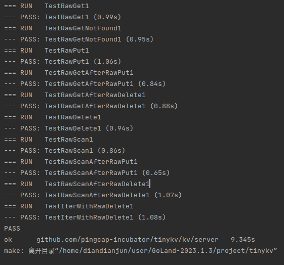

# StandaloneKV

任务一是要实现一个单机的简单的kv数据库

主要有两步

- 一是编写standalone_storage.go，实现数据库初始化、启动、关闭、和基本的读写功能
- 二是编写raw_api.go，完成数据库的增删改查接口

这一个任务整体来说还是比较简单的，因为数据库底层调用badger和对cf的一些操作都已经在engine_util和StandaloneStorageReader中封装好了，主要是用来熟悉项目的基本架构

## standalone_storage

首先是编写standalone_storage，实现读写功能

standalone_storage中有两个属性

```go
type StandAloneStorage struct {
	// Your Data Here (1).
	engine *engine_util.Engines
	conf   *config.Config
}
```

`engine_util.Engines`是数据库引擎，`config`是对数据库的一些配置，比如数据库的存储位置

启动和关闭数据库均可调用engine中自带的方法

```go
func (s *StandAloneStorage) Start() error {
	// Your Code Here (1).
	kvPath := s.conf.DBPath + "/kvPath"
	raftPath := s.conf.DBPath + "/raftPath"
	kvEngine := engine_util.CreateDB(kvPath, false)
	raftEngine := engine_util.CreateDB(raftPath, true)
	s.engine = engine_util.NewEngines(kvEngine, raftEngine, kvPath, raftPath)
	return nil
}

func (s *StandAloneStorage) Stop() error {
	// Your Code Here (1).
	err := s.engine.Kv.Close()
	err = s.engine.Raft.Close()
	return err
}
```

读取操作也很简单，因为项目也写好了StandaloneStorageReader，直接new一个StandaloneStorageReader，将数据库放进去，然后返回即可

```go
func (s *StandAloneStorage) Reader(ctx *kvrpcpb.Context) (storage.StorageReader, error) {
	// Your Code Here (1).
	reader := NewStandaloneStorageReader(s.engine.Kv)
	return reader, nil
}
```

写操作稍微麻烦一点，首先根据提供的参数，需要去阅读`modify`这个接口

发现这个接口有两种类型，并且封装了获取`key`，`value`和`cf`的方法

```go
// Modify is a single modification to TinyKV's underlying storage.
type Modify struct {
	Data interface{}
}

type Put struct {
	Key   []byte
	Value []byte
	Cf    string
}

type Delete struct {
	Key []byte
	Cf  string
}

func (m *Modify) Key() []byte {
	switch m.Data.(type) {
	case Put:
		return m.Data.(Put).Key
	case Delete:
		return m.Data.(Delete).Key
	}
	return nil
}

func (m *Modify) Value() []byte {
	if putData, ok := m.Data.(Put); ok {
		return putData.Value
	}

	return nil
}

func (m *Modify) Cf() string {
	switch m.Data.(type) {
	case Put:
		return m.Data.(Put).Cf
	case Delete:
		return m.Data.(Delete).Cf
	}
	return ""
}
```

这个`key`就是数据的键，`cf`就是数据的前缀，而`value`是`put`操作需要修改的值

由此我们有了思路，可以先判断`modify`的类型，然后再分别进行操作

```go
func (s *StandAloneStorage) Write(ctx *kvrpcpb.Context, batch []storage.Modify) error {
	// Your Code Here (1).
	for _, b := range batch {
		switch b.Data.(type) {
		case storage.Put:
			...
			break
		case storage.Delete:
			...
			break
		}
	}
	return nil
}
```

然后再看到engine_util中有封装`put`和`delete`的操作

```go
func PutCF(engine *badger.DB, cf string, key []byte, val []byte) error {
	return engine.Update(func(txn *badger.Txn) error {
		return txn.Set(KeyWithCF(cf, key), val)
	})
}
func DeleteCF(engine *badger.DB, cf string, key []byte) error {
	return engine.Update(func(txn *badger.Txn) error {
		return txn.Delete(KeyWithCF(cf, key))
	})
}
```

根据参数可知其用法，因此调用`Modify`接口的方法获取到`key`，`value`,`cf`然后分别放进去即可

```go
func (s *StandAloneStorage) Write(ctx *kvrpcpb.Context, batch []storage.Modify) error {
	// Your Code Here (1).
	for _, b := range batch {
		switch b.Data.(type) {
		case storage.Put:
			put := b.Data.(storage.Put)
			key := put.Key
			value := put.Value
			cf := put.Cf
			err := engine_util.PutCF(s.engine.Kv, cf, key, value)
			if err != nil {
				return err
			}
			break
		case storage.Delete:
			del := b.Data.(storage.Delete)
			key := del.Key
			cf := del.Cf
			err := engine_util.DeleteCF(s.engine.Kv, cf, key)
			if err != nil {
				return nil
			}
			break
		}
	}
	return nil
}
```

## raw_api

第二部分是实现数据库服务器对外的增删改查接口，类似与web中的controller层，然后具体操作调用我们之前写的standalone_storage中的读写操作

### RawGet

首先的`get`操作，这个主要是调用读操作，先获取到`StandaloneStorageReader`，然后调用reader的get方法

```go
reader, err := server.storage.Reader(req.GetContext())
val, err := reader.GetCF(req.GetCf(), req.GetKey())
```

然后把结果封装成`response`返回

```go
resp = new(kvrpcpb.RawGetResponse)
resp.Value = val
if val == nil {
    resp.NotFound = true
    return resp, nil
} else {
    resp.NotFound = false
    return resp, err
}
```

### RawPut&RawDelete

这两个操作是类似的，把`Modify`对象new出来，然后指明类型，获取`req`，`cf`，`key`，`value`中的数据封装进`Modify`中，然后把`Modify`传给`storage`中的`write`方法即可

然后也要将结果封装为对应类型的`response`对象并返回

```go
// RawPut puts the target data into storage and returns the corresponding response
func (server *Server) RawPut(_ context.Context, req *kvrpcpb.RawPutRequest) (*kvrpcpb.RawPutResponse, error) {
	// Your Code Here (1).
	// Hint: Consider using Storage.Modify to store data to be modified
	put := new(storage.Put)
	put.Key = req.GetKey()
	put.Value = req.GetValue()
	put.Cf = req.GetCf()
	modify := new(storage.Modify)
	modify.Data = *put
	modifies := make([]storage.Modify, 0)
	modifies = append(modifies, *modify)
	err := server.storage.Write(req.GetContext(), modifies)
	if err != nil {
		return nil, err
	}
	resp := new(kvrpcpb.RawPutResponse)
	return resp, nil
}

// RawDelete delete the target data from storage and returns the corresponding response
func (server *Server) RawDelete(_ context.Context, req *kvrpcpb.RawDeleteRequest) (*kvrpcpb.RawDeleteResponse, error) {
	// Your Code Here (1).
	// Hint: Consider using Storage.Modify to store data to be deleted
	delete := new(storage.Delete)
	delete.Key = req.GetKey()
	delete.Cf = req.GetCf()
	modify := new(storage.Modify)
	modify.Data = *delete
	modifies := make([]storage.Modify, 0)
	modifies = append(modifies, *modify)
	err := server.storage.Write(req.GetContext(), modifies)
	if err != nil {
		return nil, err
	}
	resp := new(kvrpcpb.RawDeleteResponse)
	return resp, nil
}
```

### RawScan

这个操作稍微麻烦一些，是从一个`cf`的`StartKey`开始批量读取数据

通过阅读项目代码发现`reader`中有一个`IterCF`方法，用来获取对应`cf`的迭代器，然后`req`中有一个属性是`StartKey`，应该就是开始的那个`key`

查看`DBIterator`源码

```go
type DBIterator interface {
	// Item returns pointer to the current key-value pair.
	Item() DBItem
	// Valid returns false when iteration is done.
	Valid() bool
	// Next would advance the iterator by one. Always check it.Valid() after a Next()
	// to ensure you have access to a valid it.Item().
	Next()
	// Seek would seek to the provided key if present. If absent, it would seek to the next smallest key
	// greater than provided.
	Seek([]byte)

	// Close the iterator
	Close()
}
```

它有一个`Seek`方法用于定位到开始的那个`Key`，`Next`方法用于迭代，`Valid`方法用于判断是否还有有效数据，`Item`方法自然就是用来获取数据的

那么通过迭代器批量读取数据的操作就已经大概知道如何写了

```go
// RawScan scan the data starting from the start key up to limit. and return the corresponding result
func (server *Server) RawScan(_ context.Context, req *kvrpcpb.RawScanRequest) (resp *kvrpcpb.RawScanResponse, respErr error) {
	// Your Code Here (1).
	// Hint: Consider using reader.IterCF
	reader, err := server.storage.Reader(req.GetContext())
	if err != nil {
		return nil, err
	}
	iter := reader.IterCF(req.GetCf())
	iter.Seek(req.StartKey)
	resp = new(kvrpcpb.RawScanResponse)
	var i uint32 = 0
	for ; i < req.Limit && iter.Valid(); i++ {
		pair := new(kvrpcpb.KvPair)
		pair.Key = iter.Item().Key()
		value, err := iter.Item().Value()
		if err != nil {
			return nil, err
		}
		pair.Value = value
		resp.Kvs = append(resp.Kvs, pair)
		iter.Next()
	}
	iter.Close()
	reader.Close()
	return resp, nil
}
```

一些具体的数据类型比如`KvPair`可以根据返回的`response`中所需的数据来得到，一些操作也可以看源码提供的接口。

## 测试

在项目的根目录下

```shell
make project1
```

会自动调用项目1的测试用例并显示测试结果



在make之前也可以自己先在server_test.go中把那些测试先跑一遍看看有什么问题

## 需要注意的点

### CF的含义

列族（CF, Column family）是一个类似 key 命名空间的术语，即同一个 key 在不同列族中的值是不同的。你可以简单地将多个 CF 视为独立的小型数据库

其实就是一个key的前缀，通过划分不同的cf将不同的key分开使得效果上达到分数据库、分表的效果

### 资源记得关闭

`storage`这样的资源不需要考虑关闭，只要你在编写`standalone_storage`时完成了它的开启与关闭接口，那么官方编写的测试用例里会按照规范来开启和关闭的

但是像`reader`，`iter`这种资源，在增删改查接口中用完了之后要记得close，要不然会出现一些问题