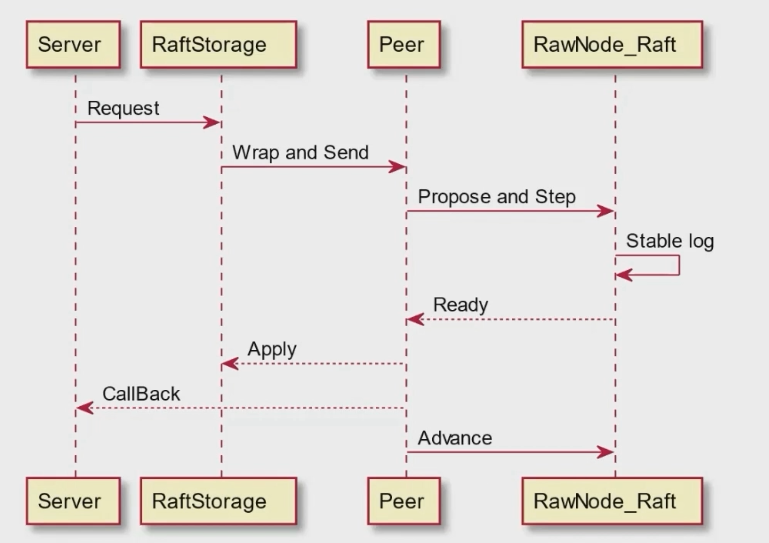
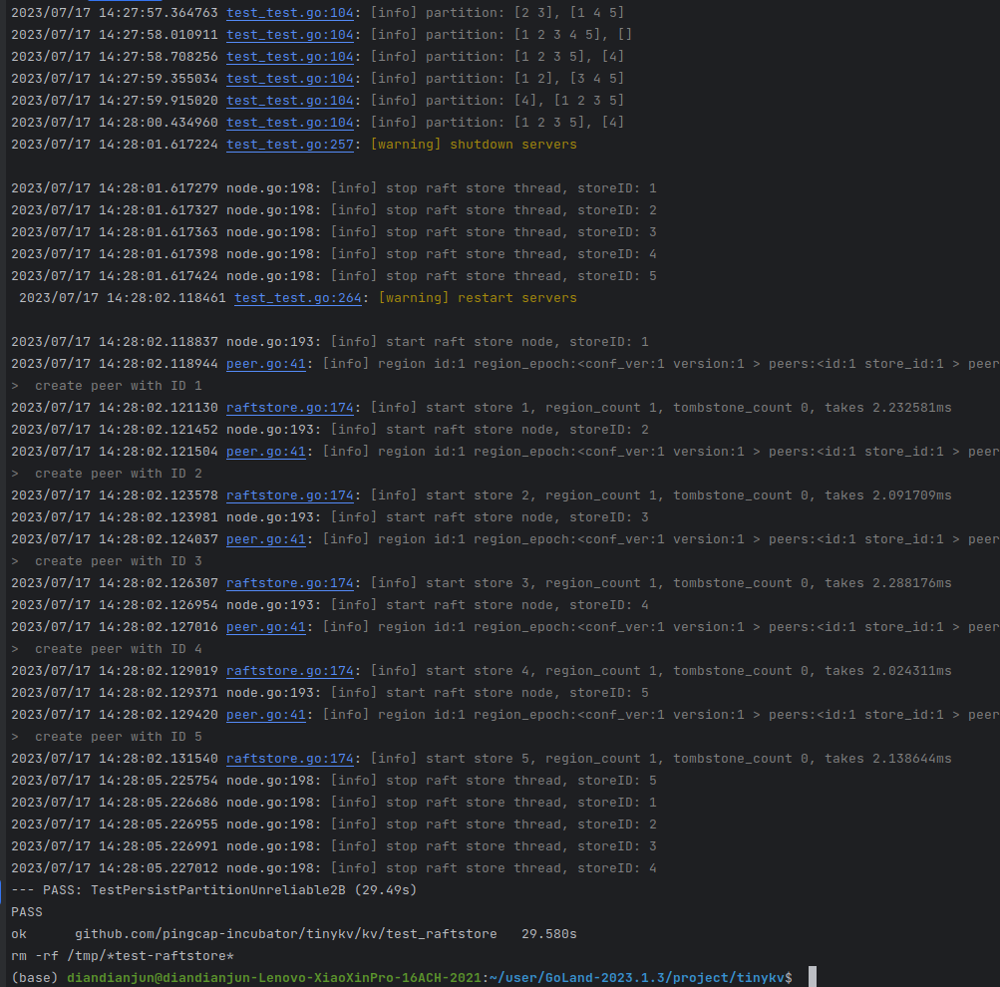
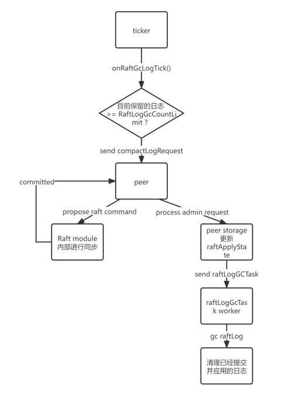
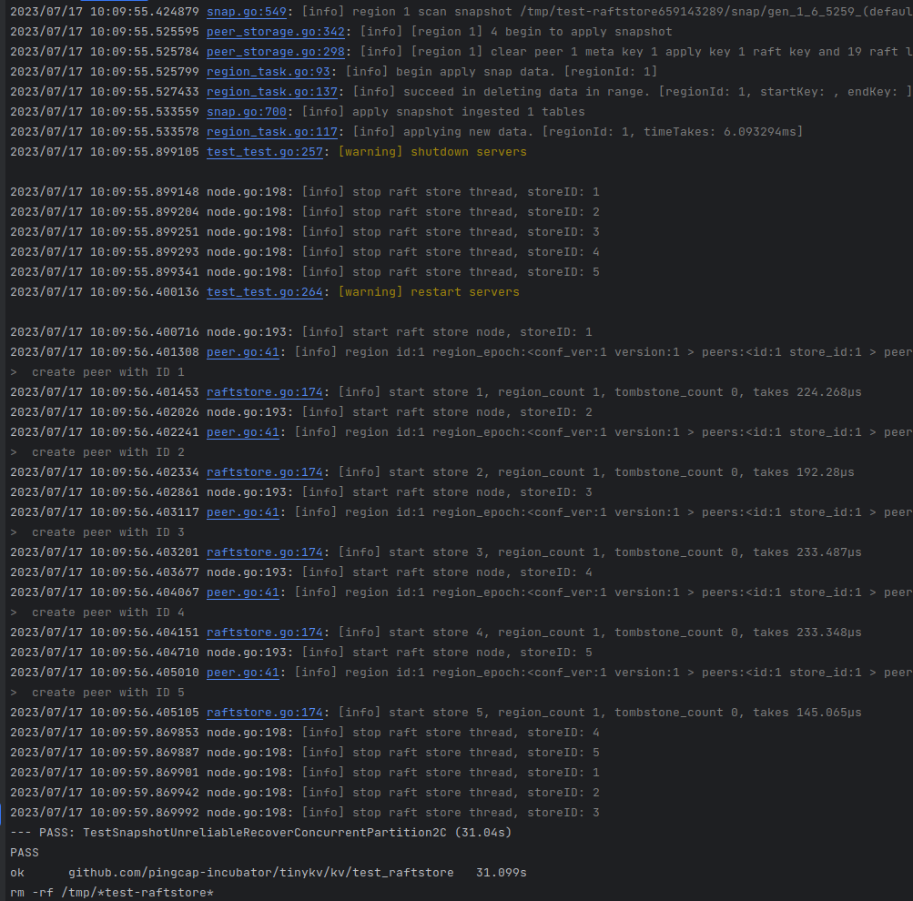
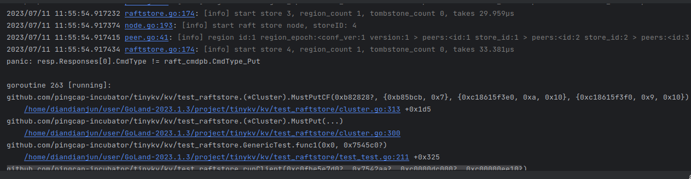
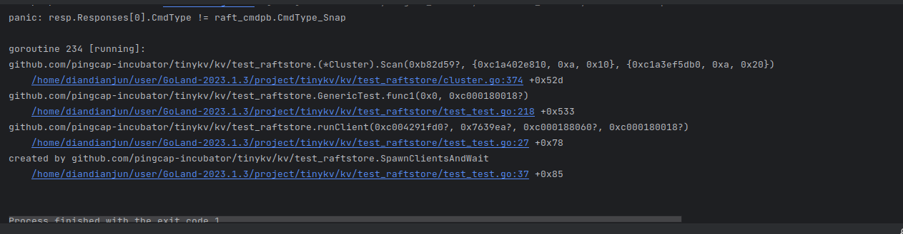
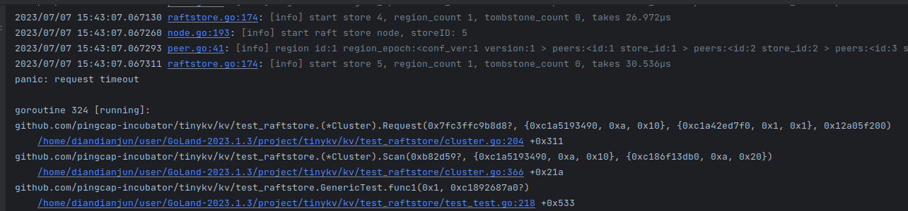
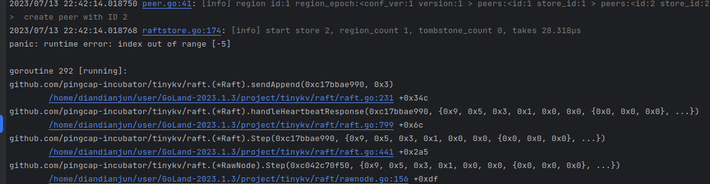
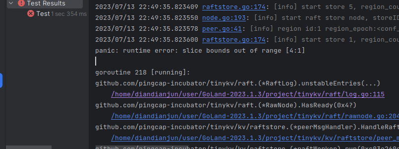

# raft

## project2A

1. 实现raft基本功能
    - 领导选举
    - 日志同步

2. 与上层交互的接口

### 初始化

Raft 结构体

```go
type Raft struct {
	Term uint64
	Vote uint64
	RaftLog *RaftLog
	Prs map[uint64]*Progress
	State StateType
	votes map[uint64]bool
	msgs []pb.Message
	Lead uint64
	heartbeatTimeout int
	electionTimeout       int
	randomElectionTimeout int
	heartbeatElapsed int
	electionElapsed int
	leadTransferee uint64
	PendingConfIndex uint64
}
```

- `id uint64`：表示Raft节点的唯一标识符。
- `Term uint64`：表示Raft节点的当前任期。
- `Vote uint64`：存储在当前任期中获得选票的节点的ID。
- `RaftLog *RaftLog`：指向Raft日志，其中包含已提交和未提交的条目。
- `Prs map[uint64]*Progress`：存储每个集群中同行的日志复制进度。
- `State StateType`：表示Raft节点的角色（如领导者、追随者、候选人）。
- `votes map[uint64]bool`：跟踪Raft节点在选举中收到的选票。
- `msgs []pb.Message`：表示Raft节点需要发送的消息。
- `Lead uint64`：存储当前领导者的ID。
- `heartbeatTimeout int`：指定发送心跳的间隔。
- `electionTimeout int`：表示选举间隔的基准值。
- `randomElectionTimeout int`：表示随机化的选举超时时间。
- `heartbeatElapsed int`：跟踪自上次心跳超时以来的时钟周期数。
- `electionElapsed int`：跟踪自上次选举超时或从领导者接收到有效消息以来的时钟周期数。
- `leadTransferee uint64`：表示在领导者转移过程中目标转移的领导者的ID。
- `PendingConfIndex uint64`：存储日志中最新待处理配置更改的索引。

`randomElectionTimeout int`要在以下几个情况下重置
成为候选人（Candidate）：当节点从跟随者（Follower）状态转变为候选人状态时

收到有效的领导者（Leader）消息：当节点处于跟随者状态，并且接收到有效的来自当前领导者的消息时

选举超时时间到期：每个节点在成为候选人之前都会设置一个随机的选举超时时间范围。如果选举超时时间到期而节点仍然是跟随者状态，它会转变为候选人并开始选举过程。在这种情况下，节点会重置随机选举超时时间，以便在下一次选举中使用。

RaftLog 结构体

```go
type RaftLog struct {
	storage Storage
    committed uint64
    applied uint64
    stabled uint64
	entries []pb.Entry
	pendingSnapshot *pb.Snapshot
	LogIndex uint64
}
```

- `storage Storage`：存储了从上一个快照之后的所有稳定的日志条目。
- `committed uint64`：已知在大多数节点的稳定存储中的最高日志位置。
- `applied uint64`：应用程序被指示应用到其状态机的最高日志位置。约束条件：applied <= committed。
- `stabled uint64`：已持久化到存储中的索引小于等于 stabled 的日志条目。它用于记录尚未由存储持久化的日志条目。每次处理 Ready 时，未稳定的日志将被包含在其中。
- `entries []pb.Entry`：尚未被压缩的所有日志条目。
- `pendingSnapshot *pb.Snapshot`：传入的不稳定快照（如果有的话）。在 2C 阶段使用。
- `LogIndex uint64`：存储中的第一个日志的索引。初始化为storage.FirstIndex()

committed 表示已经达成共识并持久化的日志位置，用于确定哪些日志已经被提交，可以进行状态机的应用。

applied 表示应用程序已经将日志应用到其状态机的位置，用于跟踪状态机的应用进度，以保持节点之间的一致性。

stabled 表示已经稳定存储到持久化介质的日志位置，用于确定哪些日志已经持久化，可以从内存中释放。


### tick() 函数

tick() 函数是一个逻辑时钟

Follower维护一个electionElapsed计数器，当electionElapsed超过electionTimeout时，Follower会变成Candidate，发起一次新的选举。candidate会重新发起一次选举

leader会发送心跳包，维持自己的leader地位

### Step() 函数

用于处理消息请求，根据消息的类型和当前状态，执行相应的操作。

从网络接收到来自其他节点的消息：当节点作为网络的一部分，接收到来自其他节点的消息时，网络层会将消息传递给对应的 Raft 节点的 Step 函数进行处理。

但也有可能是本地的消息，比如本地的定时器超时，也会调用 Step 函数。

```go
    MsgHup = 0;
    MsgBeat = 1;
    MsgPropose = 2;
    MsgAppend = 3;
    MsgAppendResponse = 4;
    MsgRequestVote = 5;
    MsgRequestVoteResponse = 6;
    MsgSnapshot = 7;
    MsgHeartbeat = 8;
    MsgHeartbeatResponse = 9;
    MsgTransferLeader = 11;
    MsgTimeoutNow = 12;
```

- MsgHup 发起选举：当节点检测到选举超时时，它可以通过调用 Step 函数并传递 MessageType_MsgHup 消息来发起新的选举过程。

- MsgBeat 发送心跳：领导者节点可以定期发送心跳消息以维持其领导地位和通知追随者其仍然活跃。领导者节点可以通过调用 Step 函数并传递 MessageType_MsgBeat 消息来触发发送心跳。

- MsgPropose 提议日志追加：上层可以通过调用 Step 函数并传递 MessageType_MsgPropose 消息，向当前的领导者提议追加数据到日志条目中。

- MsgAppend 日志追加请求：领导节点可以通过调用 Step 函数并传递 MessageType_MsgAppend 消息，向其他节点发送日志追加请求，用于进行日志的复制和同步。

- MsgRequestVote 请求选票：在选举过程中，候选人节点可以通过调用 Step 函数并传递 MessageType_MsgRequestVote 消息，向其他节点请求投票以获取支持。

- MsgSnapshot 快照请求：领导节点可以通过调用 Step 函数并传递 MessageType_MsgSnapshot 消息，向其他节点发送快照请求，用于进行快照的复制和应用。

- MsgHeartbeat 心跳请求：领导者节点可以通过调用 Step 函数并传递 MessageType_MsgHeartbeat 消息，向追随者发送心跳请求，用于维持领导者地位和通知追随者其仍然活跃。

- MsgTransferLeader 领导者转移请求：上层可以通过调用 Step 函数并传递 MessageType_MsgTransferLeader 消息，请求领导者进行领导权的转移。

- MsgTimeoutNow 领导者转移超时请求：领导者节点可以通过调用 Step 函数并传递 MessageType_MsgTimeoutNow 消息，通知领导权转移的目标节点立即超时并开始新的选举过程。

### become系列函数

- becomeFollower()：将节点转变为跟随者状态。
- becomeCandidate()：将节点转变为候选人状态。
- becomeLeader()：将节点转变为领导者状态。
  - 改变状态、更新heartbeatElapsed，electionElapsed。
  - 初始化Prs，更新Next、Match。
  - 添加一个在本地添加noop日志项的消息到 Step 函数中。

### 与上层交互的接口

Ready结构体

```go
type Ready struct {
	*SoftState
	pb.HardState
	Entries []pb.Entry
	Snapshot pb.Snapshot
	CommittedEntries []pb.Entry
	Messages []pb.Message
}
```

softState（软状态）是节点的当前易失性状态，它包含的信息相对较少且易变。softState 的主要目的是提供一些有关节点当前状态的快速访问，以便在需要时进行一些决策或信息展示。例如，softState 可以包含节点的角色（Follower、Candidate、Leader）以及与选举相关的信息，如当前任期号、投票候选人 ID 等。softState 是一个不需要持久化的状态，它可以在节点重启后被重新初始化。

hardState（硬状态）是节点的当前状态，它需要被持久化保存，以确保在节点故障或重新启动后能够恢复到之前的状态。hardState 包含的信息相对较多且相对稳定。它包含了节点的当前任期号、投票候选人 ID 和已提交的日志索引等关键信息。当节点状态发生变化时，如选举结果、日志追加或节点转变角色时，hardState 需要被更新和保存到稳定存储介质，以便在恢复节点时能够恢复到正确的状态。

softState 是节点的当前易失性状态，提供了节点状态的快速访问，但不需要持久化。hardState 是节点的当前状态，包含了关键的信息，需要被持久化保存以确保节点的持久性和一致性。

CommittedEntries 是已提交的日志条目到已持久化的日志条目，中间这部分是已持久化但未提交的日志条目。

- Ready()：返回一个 Ready 结构体，其中包含了当前节点的状态变化和需要发送给其他节点的消息。
- Advance()：将节点的状态推进到 Ready 中的 CommittedIndex 和 AppliedIndex。
- HasReady()：判断 Ready 中是否包含了需要发送给其他节点的消息。
  - 判断是否有消息需要发送
  - 判断是否有需要应用的条目
  - 判断是否有需要应用的快照
  - 判断是否有状态改变或持久化
  - 判断是否有需要持久化的条目

### 测试


遇到的问题：
- 之前处理投票请求时忘了return，导致一直在投票没有停止
    
- raft初始化后调用了becomeFollower，导致之前初始化的term, vote等信息被覆盖，从而出现一些奇怪的错误
- HasReady函数中，一开始将softState也加入到判断中，导致一直返回true，无法停止
- 之前没搞清楚什么时候重置选举超时时间，导致一些测试用例无法通过

## project2B

- proposeRaftCommand
- HandleRaftReady
- Append
- SaveReadyState

Request 执行流程




Raft Worker接收到raft消息后，首先调用PeerMsgHandler的HandleMsg()来propose消息

Propose的目的就是将这个Request以entry的形式放到Peer目前的RaftLog中，等到这个日志被大部分group commit之后，再通过HandleRftReady进行执行

只有Leader才能处理这种propose请求

### proposeRaftCommand

将发来的request转换成raft的entry，然后发送给raft中的leader节点来处理

使用的主要是msg.Marshal()和msg.Unmarshal()函数来进行转换，同时要把这个proposals放到Proposals中，等待raft处理完之后再进行回复

### HandleRaftReady

在raft处理完request之后，调用HandleRaftReady来处理一批已经被committed的entry

流程如下

1. 如果这个Peer已经被删除了，那么直接返回
2. 判断一下rawNode中是否有需要处理的ready，如果有，则获取一个ready来处理
3. 首先通过PeerStorage的SaveReadyState来保存一些状态，比如hardState，snapshot等
4. 然后通过d.Send(d.ctx.trans, ready.Messages)将消息发送
5. 然后对这次committed的entry进行应用
6. 通过advance()来更新状态

应用过程

1. 通过Unmarshal函数把request从entry中解析出来
2. 根据请求的类型来进行处理，Put和Delete的请求通过writeBatch写入到kv中，然后放入空的response。Get请求则从kv中读取数据，然后放入response中。snap请求则直接给它peer的region以为它开启一个供读的transaction
3. 一个request中的所有请求都处理完成后，就可以认为这个entry已经被apply了，所以要把这个entry的index放入到appliedIndex中，然后返回

### SaveReadyState

将ready中的更新保存到磁盘中

1. 首先判断一下是否有需要保存的snapshot，如果有，则调用ApplySnapshot来保存
2. 然后判断一下是否有需要保存的hardState，如果有，则修改raft中的hardState
3. 然后调用append将这个ready中的entries保存到raftLog中
4. 最后将raft状态保存到raftStorage中

### Append

将ready中的entries保存到raftLog中

### 测试通过



### 遇到的问题

1. SaveReadyState保存时忘记把db放进去了，导致一直报空指针
    
2. process中处理请求时
    
   
    在CmdType_Snap中加入
    
   p.cb.Txn = d.peerStorage.Engines.Kv.NewTransaction(false)
3. process函数中，在处理普通request时，要return返回的WriteBatch而不是传进去的wb
    
    

## project2C

由于在系统运行过程中，日志会无限增长，因此需要定期进行snapshot，将日志进行压缩，只保留最新的一部分日志




### raft中

增加一种处理MessageType_MsgSnapshot请求的操作

1. 该方法首先从接收到的快照消息中提取元数据。
```go
meta := m.Snapshot.Metadata
```
2. 它检查快照的索引是否小于或等于已提交的最新日志条目的索引。如果是这样，它将附加一个类型为MessageType_MsgAppendResponse的消息到msgs列表中，并返回。
3. 接下来，更新RaftLog的相关字段。将entry的开始索引设置为快照的索引加1，表示快照后第一个日志条目的索引。将applied、committed和stabled都设置为快照的索引。
4. 创建一个空的Progress结构体的映射，用于表示每个对等节点的进度。根据快照元数据中的配置状态，为每个对等节点创建一个空的Progress结构体，并将其添加到Prs映射中。
5. 将pendingSnapshot字段设置为接收到的快照。
6. 最后，将一个带有MessageType_MsgAppendResponse类型的消息添加到msgs列表中。消息的Index字段设置为RaftLog的最后一个日志条目的索引。

### peer_msg_handler中

在本部分中，当日志增长超过 RaftLogGcCountLimit 的限制时，会要求本节点整理和删除已经应用到状态机的旧日志。节点会接收到类似于 Get/Put/Delete/Snap 命令的 CompactLogRequest，因此我们需要在 lab2b 的基础上，当包含 CompactLogRequest 的 entry 提交后，增加 processAdminRequest() 方法来对这类 adminRequest 的处理。

在 processAdminRequest() 方法中，我们需要更新 RaftApplyState 中 RaftTruncatedState 中的相关元数据，记录最新截断的最后一个日志的 index 和 term，然后调用 ScheduleCompactLog() 方法，异步让 RaftLog-gc worker 能够进行旧日志删除的工作。

另外，因为 raft 模块在处理 snapshot 相关的 msg 时，也会对一些状态进行修改，所以在 peer_storage.go 方法中，我们需要在 SaveReadyState() 方法中，调用 ApplySnapshot() 方法中，对相应的元数据进行保存。

在 ApplySnapshot() 方法中，如果当前节点已经处理过的 entries 只是 snapshot 的一个子集，那么需要对 raftLocalState 中的 commit、lastIndex 以及 raftApplyState 中的 appliedIndex 等元数据进行更新，并调用 ClearData() 和 ClearMetaData() 方法，对现有的 stale 元数据以及日志进行清空整理。同时，也对 regionLocalState 进行相应更新。最后，我们需要通过 regionSched 这个 channel，将 snapshot 应用于对应的状态机

除此之外，对于adminRequest的propose过程也与普通的读写请求有所不同，如AdminCmdType_Split需要判断splitKey是否在当前region中，同时为了应对project3中新加的另外两种请求，我们需要在peer_msg_handler.go中增加一个proposeAdminRequest()方法，用于处理这类命令请求。

### 测试通过



### 遇到的问题




proposeRaftCommand中有一次改代码不小心把上面预先写好的一段代码给删了，导致了上面这种情况

```go
err := d.preProposeRaftCommand(msg)
if err != nil {
    cb.Done(ErrResp(err))
    return
}
```



proposeAdminRequest中，AdminCmdType_CompactLog请求不需要将proposal加到proposals中，因为它不需要回调函数，把它加进去会导致server一直在等待回调，从而导致请求超时





忘记在advance中压缩日志，就会出现上面的情况
```go
//丢弃被压缩的日志
rn.Raft.RaftLog.maybeCompact()
```