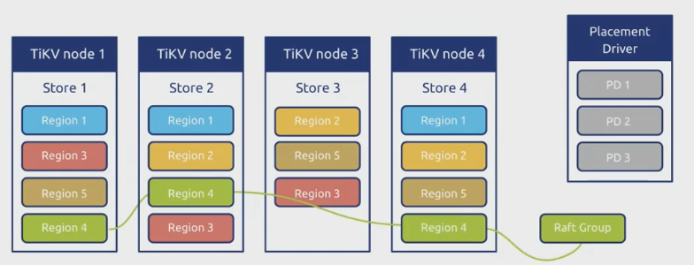

# MultlRaft

这一节需要实现一个带有balance scheduler的基于multi-raft的kv服务器，需要实现领导人转移和成员变更，需要在raftstore上实现配置变更和region split，最后实现负载均衡调度器

- region
  1. TiKV中管理数据的基本单位
  2. 数据切片，按连续的一段key range划分
  3. 一个region包含多个peer，每个peer负责一个副本
  4. 一个region对应一个raft group
  5. 每个region的副本均匀的分布在TiKV节点上
- Multi-Raft
  1. 一个集群的数据被划分为多个region
  2. 多个独立独立运行的raft group
  3. 各个raft group的peer按高可用与负载均衡等规则均匀分布在各个TiKV节点中



RaftStore 上一些需要实现的schedule操作

- Add peer
- Remove peer
- Split region
- Merge region
- Transfer leader

### Region Spilt

作用
- 加大并发
- 缓解热点

split策略
- 根据region size
- 根据region key range
- 根据region leader
- 根据region hot degree

spilt流程
- leader检测到region size超过阈值
- 为region计算spilt key
- 向Placement Driver请求分配新的region id
- leader向所有follower发送split命令，并将日志写入raft log
- 进行与普通写入一样的propose和commit流程
- Apply spilt命令，生成新的region
  1. 根据spilt key计算key range
  2. 根据region id，peer id，key range生成新的region
  3. 更改原region的end key
  4. 将新region添加到raft group中
  5. 不涉及数据搬迁，只根据spilt key划分region

### Add/Remove Peer

目的一般是在TiKV节点之间移动副本

-  负载均衡
  
    使得每个TiKV节点上的region数尽量均匀
- 上下线TiKV节点

    比如有新的实例加入集群时，需要将一些region的数据副本迁移到新的实例上
- 修复故障

    比如某个TiKV节点宕机，需要将该节点上的region的副本迁移到其他节点上

通过Raft ConfChange 进行

- Simple ConfChange
  - Add Peer
  - Remove Peer
- Joint Consensus
  - Add Peer
  - Remove Peer
  - Add Learner
  - Promote Learner

Add Peer
  1. Placement Driver 下发ConfChange command
  2. leader向所有follower发送add peer命令，并将日志写入raft log
  3. 进行与普通写入一样的propose和commit流程
  4. Apply add peer命令，生成新的region
    - 生成新的peer id
    - 将新的peer添加到raft group中
    - 将新的peer添加到region中
    - 将新的peer添加到store中
    - 将新的peer添加到scheduler中

Create Peer
 1. 更改peer list后会向新peer发心跳消息，补上peer之前缺失的日志
 2. Raft消息触发新peer所在TiKV节点创建peer
 3. 新peer通过快照将前面的log补上

Destroy Peer
 1. Apply ConfChange后触发
 2. 删除数据
 3. 清理内存结构体 

### 其他Schedule

- Merge region
  - 通过admin raft log
  - 合并相邻key range的region
  - 减少region数量
- Transfer leader
  - 无需添加admin raft log
  - Leader 发送MsgTimeoutNow触发目标发起选举
  - Leader transfer期间会停止接受propose，以防止follower的日志进度永远落后

## Project3A

实现raft层对LeaderTransfer和节点增删的支持

### LeaderTransfer

上层通过调用raftstore的transfer_leader接口，raftstore会向leader发送MessageType_MsgTransferLeader类型的请求

leader接到LeaderTransfer请求后，会先判断目标节点的日志复制进度，如果不够新就先发送append请求，如果足够新则直接向目标节点发送MsgTimeoutNow消息，目标节点收到消息后会立即发起选举，选出新的leader

TransferLeader期间不接收propose请求

### AddNode/RemoveNode

增加和删减Prs即可，remove操作要多做一步updateCommit

### 测试


### 遇到的问题


处理MsgTimeoutNow信息时，如果当前节点不是leader，要判断日志复制进度是否足够，如果不够就应直接返回，够了进行选举，这里没处理，导致没有选举

## Project3B

### raft_cmdpb.AdminCmdType_TransferLeader

需要新处理一种adminRequest请求叫做TransferLeader

通过调用RawNode中的TransferLeader方法，TransferLeader会通过 Step() 函数输入到 Raft层。

```go
d.RaftGroup.TransferLeader(req.TransferLeader.Peer.Id)
```

不需要追加proposals

### raft_cmdpb.AdminCmdType_ChangePeer

需要新处理一种adminRequest请求叫做ChangePeer

通过调用RawNode中的ProposeConfChange方法提交

```go
d.RaftGroup.ProposeConfChange(context)
```

不需要追加proposals

process过程中

1. 修改 region.Peers，是删除就删除，是增加就增加一个 peer。如果删除的目标节点正好是自己本身，那么直接调用 d.destroyPeer() 方法销毁自己，并直接 return。
2. region.RegionEpoch.ConfVer++。
3. 使用 meta.WriteRegionState() 方法写到 kvDB 里。
4. 调用 d.insertPeerCache()。将peer信息存入，以便其他store获取到消息数据。
5. 调用 d.RaftGroup.ApplyConfChange() 方法，使消息传导到raft层调用add和remove方法
6. 调用HeartbeatScheduler()方法，快速刷新 scheduler 那里的 region 缓存

### 遇到的问题


remove peer的时候数组越界，找peerId的时候会出现没找到的情况，没找到的话就不remove了
