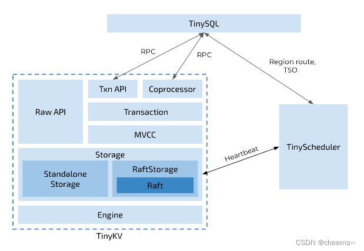
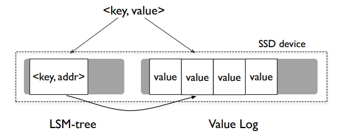
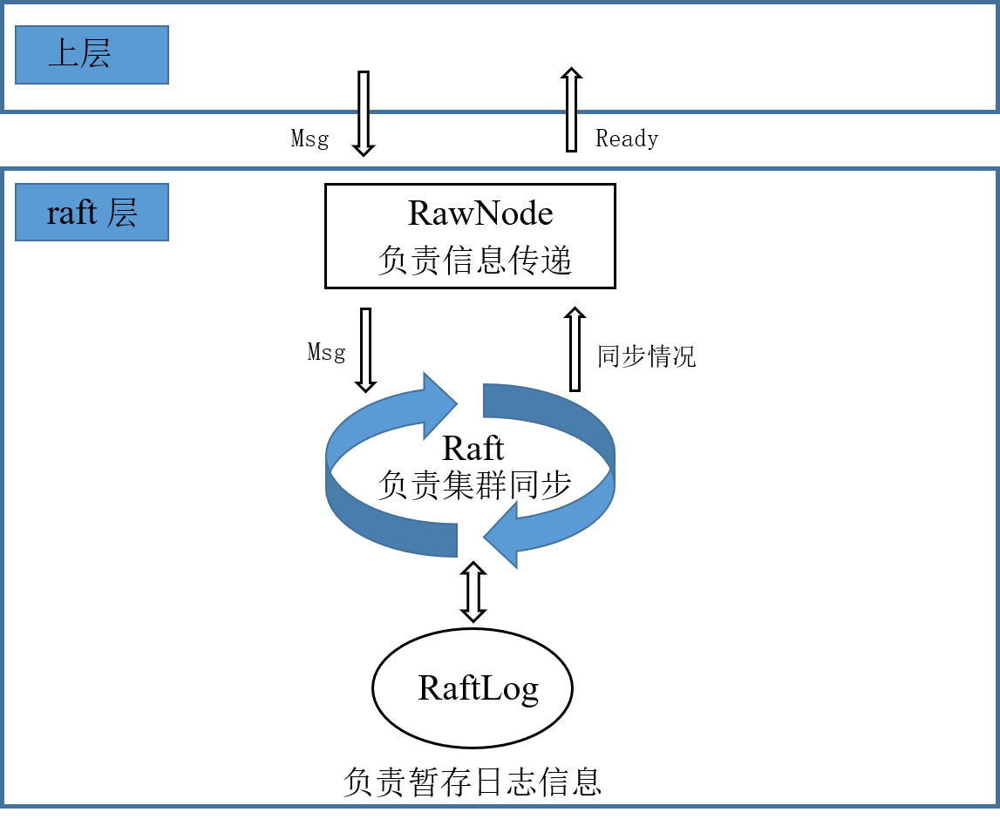
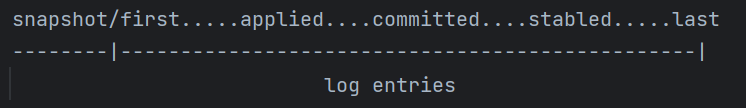
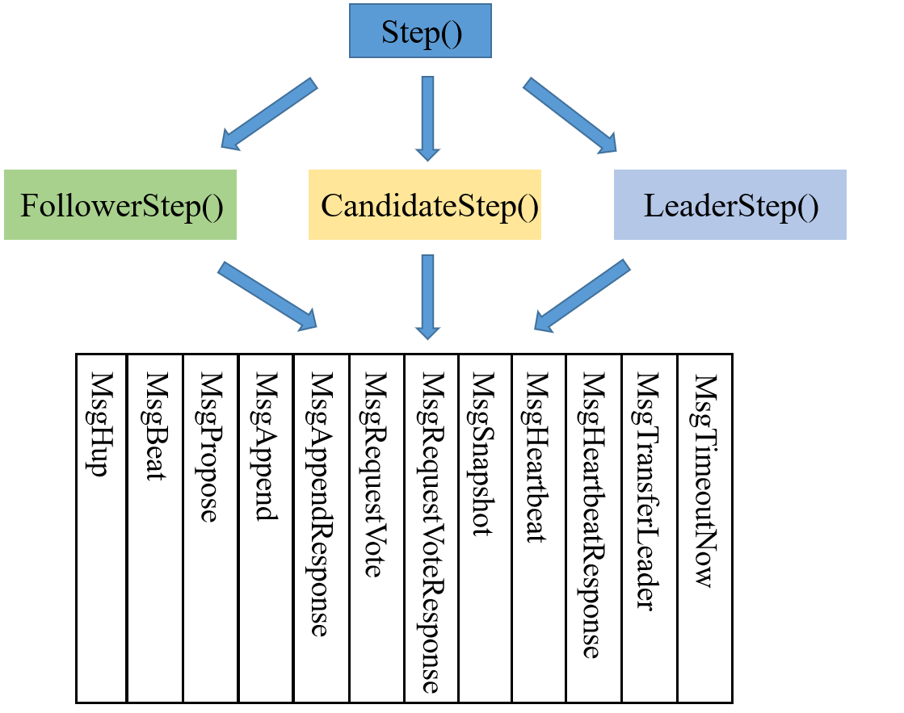
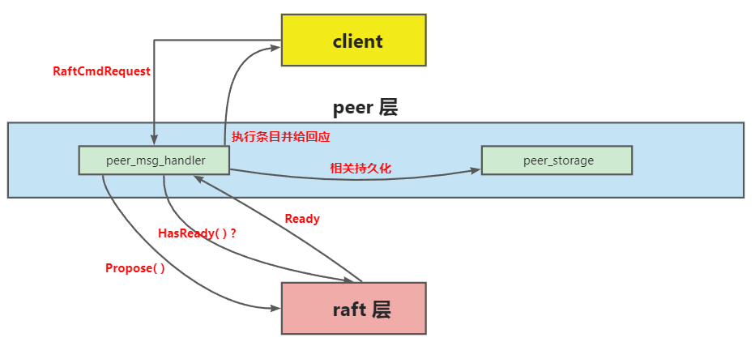

# 分布式数据库架构文档

## 1. 项目体系结构视图



原项目的整体架构体系结构视图如上图所示。我们的项目实现的是TinyKV部分，这部分主要包括：
1. StandaloneStorage：单机KV存储引擎，实现了基本的KV存储功能
2. RaftStorage：基于Raft协议的分布式KV存储引擎，实现了基本的分布式KV存储功能
3. Transaction：分布式事务，实现了分布式事务的原子性
4. RawAPI：提供给客户端的API，实现了客户端与服务器之间的协作协议

## 2. 项目的目录结构/模块划分
1. kv包含键值存储的实现。
2. raft包含 Raft 共识算法的实现。
3. scheduler包含 TinyScheduler 的实现，负责管理 TinyKV 节点和生成时间戳。
4. proto包含节点和进程之间的所有通信的实现，使用基于 gRPC 的协议缓冲区。这个包包含了 TinyKV 使用的协议定义，以及生成的你可以使用的 Go 代码。
5. log包含根据级别输出日志的实用程序。

## 3. 数据流和通信
采用高性能，开源和通用的RPC框架，基于Protobuf序列化协议开发

## 4. 存储底层
存储底层采用的是badgerDB，Badger 是一个高性能的键值存储引擎，专为支持分布式系统、应用程序和云原生应用而设计。它的特点包括：

- 持久性：Badger 是一种持久性存储引擎，可以将数据持久化到磁盘，以确保数据在系统重启或故障时不会丢失。

- 高性能：Badger 针对高吞吐量和低延迟进行了优化，适用于需要快速读写大量数据的应用程序。

- 内存管理：Badger 使用内存映射技术，将磁盘上的数据映射到内存中，以提高读取性能。

- 并发控制：Badger 支持多线程并发访问，能够有效处理多个读取和写入请求。

- 事务支持：Badger 提供事务支持，允许应用程序以原子方式执行一系列操作。

- 复杂查询：Badger 支持范围查询和前缀查询等高级查询功能，使其适用于各种用例，包括索引和搜索。

- 空间效率：Badger 使用了一种称为 LSM（Log-Structured Merge）树的存储引擎，以实现高效的写入操作和紧凑的数据存储。

- Go 语言实现：Badger 是用 Go 语言实现的，这使得它在 Go 生态系统中非常流行，可以轻松地与其他 Go 语言库和框架集成。

- Badger 的设计目标是提供可靠、高性能、易于使用的键值存储解决方案，适用于各种应用场景，包括缓存、元数据存储、日志存储等。它广泛用于分布式系统、容器化应用程序和云原生应用中，以满足数据存储和检索的需求。



## StandaloneStorage

gRPC 服务在 kv/main.go 中被初始化，它包含一个 tinykv.Server，它提供了名为 TinyKv 的 gRPC 服务 。它由 proto/proto/tinykvpb.proto 中的 protocol-buffer 定义，rpc 请求和响应的细节被定义在 proto/proto/kvrpcpb.proto 中。

StandaloneStorage和RaftStorage都实现了Storage接口，Storage接口定义如下：
```go
type Storage interface {
    Write(ctx *kvrpcpb.Context, batch []Modify) error
    Reader(ctx *kvrpcpb.Context) (StorageReader, error)
}
```
Storage接口定义了两个方法，Write方法用于写入数据，Reader方法用于读取数据。

StandaloneStorage的结构体定义如下：
```go
type StandAloneStorage struct {
	engine *engine_util.Engines
	conf   *config.Config
}
```
StandaloneStorage的结构体包含了两个成员，engine和conf
engine是badgerDB的一个封装，便于执行对数据库的存取操作
```go
type Engines struct {
	Kv     *badger.DB
	KvPath string
	Raft     *badger.DB
	RaftPath string
}
```
config是一个配置文件，包含了一些配置信息，如数据存储的路径等

## RawAPI

```go
type TinyKvServer interface {
	// KV commands with mvcc/txn supported.
	KvGet(context.Context, *kvrpcpb.GetRequest) (*kvrpcpb.GetResponse, error)
	KvScan(context.Context, *kvrpcpb.ScanRequest) (*kvrpcpb.ScanResponse, error)
	KvPrewrite(context.Context, *kvrpcpb.PrewriteRequest) (*kvrpcpb.PrewriteResponse, error)
	KvCommit(context.Context, *kvrpcpb.CommitRequest) (*kvrpcpb.CommitResponse, error)
	KvCheckTxnStatus(context.Context, *kvrpcpb.CheckTxnStatusRequest) (*kvrpcpb.CheckTxnStatusResponse, error)
	KvBatchRollback(context.Context, *kvrpcpb.BatchRollbackRequest) (*kvrpcpb.BatchRollbackResponse, error)
	KvResolveLock(context.Context, *kvrpcpb.ResolveLockRequest) (*kvrpcpb.ResolveLockResponse, error)
	// RawKV commands.
	RawGet(context.Context, *kvrpcpb.RawGetRequest) (*kvrpcpb.RawGetResponse, error)
	RawPut(context.Context, *kvrpcpb.RawPutRequest) (*kvrpcpb.RawPutResponse, error)
	RawDelete(context.Context, *kvrpcpb.RawDeleteRequest) (*kvrpcpb.RawDeleteResponse, error)
	RawScan(context.Context, *kvrpcpb.RawScanRequest) (*kvrpcpb.RawScanResponse, error)
	// Raft commands (tinykv <-> tinykv).
	Raft(TinyKv_RaftServer) error
	Snapshot(TinyKv_SnapshotServer) error
	// Coprocessor
	Coprocessor(context.Context, *coprocessor.Request) (*coprocessor.Response, error)
}
```

实现一个 K-V service handler，让读写操作以 API 的方式暴露出去供上层使用。其中包括 RawGet 、RawScan、RawPut、RawDelete。四者作用分别为：

获取对应 CF_Key 的 Value；
在指定的 CF 中，从 StartKey 开始扫描 KvPair，上限为 Limit；
写入一个 KvPair；
删除一个 KvPari；
首先是 RawGet 和 RawScan，二者都是读操作，通过 storage 的 Reader 来执行读。首先，通过 server.storage.Reader() 获取到 reader。如果是 RawGet，那么通过 reader.GetCF() 直接获取到值，然后包装成 resp 返回回去。如果是 RawScan，那么通过 reader.RawScan() 先获取到迭代器，接着按照 StartKey 开始遍历，将遍历到的 K-V 整合起来即可，遍历时要注意 Limit 限制，整合完成后依然包装成 resp 返回回去。需要注意的是，如果 RawGet 没有获取到，那么返回时要标记 resp.NotFound = true。

RawPut 和 RawDelete 两者实现非常相似，都是将请求包装成 Modify 的 batch，然后通过 server.storage.Write() 执行写操作，最后把执行的结果包装成 resp 返回回去即可。二者的 Modify 有所不同，如下：

```go
// Put
put := storage.Put{
Key: req.Key,
Value: req.Value,
Cf: req.Cf,
}
modify := storage.Modify{
Data: put,
}
// Delete
del := storage.Delete{
Key: req.Key,
Cf: req.Cf,
}
modify := storage.Modify{
Data: del,
}
```

## RaftStorage
实现一个基于 Raft 的高可用 KV 服务器

- 首先实现基于 Raft 的同步过程 
- 实现 Raft 的上层调用与底层存储
- 用来在前两者的基础上增加日志压缩和快照的功能。

### Raft算法
Raft 是一个易于理解的一致性算法，其会保证结果的最终一致性。Raft 将一致性算法分解成了几个关键模块，如领导人选举、日志同步与安全性。

- 领导人选举：当现存的领导人发生故障的时候，一个新的领导人需要被选举出来。
- 日志同步：领导人必须从客户端接受日志条目，然后同步到集群中的其他节点，并强制要求其他节点的日志和自己保持一致，即强领导特性。
- 安全性：如果有任何的服务器节点已经应用了一个确定的日志条目到它的状态机中，那么其他服务器节点不能在同一个日志索引位置应用一个不同的指令。

Raft 最为核心的运行逻辑，即 Leader、Follower、Candidate 三种角色的互相转换与 RPC 处理。

首先是所有的节点上都应该含有的字段（不区分角色），其中包含了节点的基本信息、投票情况、日志记录、日志相关指针等等，分为持久性状态与易失性状态，如表所示：


| 字段        | 意义                                     | 状态   |
| ----------- | ---------------------------------------- | ------ |
| NodeID      | 节点 ID                                  | 持久性 |
| currentTerm | 节点当前的 Term                          | 持久性 |
| votedFor    | 当前 Term 内，节点把票投给了谁           | 持久性 |
| log[]       | 日志条目                                 | 持久性 |
| commitIndex | 已知已提交的最高的日志条目的索引         | 易失性 |
| lastApplied | 已经被应用到状态机的最高的日志条目的索引 | 易失性 |

其中，提交是指集群中 半数以上 的节点均同步了这条日志，才算作提交。而应用是指将日志应用到状态机中，即执行日志中的命令。

领导人唯一地从客户端接受指令，以日志条目的方式同步给集群中的其余节点，为了维持每个节点的同步信息，领导人需要额外两个字段去进行记录，如下：

| 字段         | 意义                                                         | 状态   |
| ------------ | ------------------------------------------------------------ | ------ |
| nextIndex[]  | 对于每个节点，待发送到该节点的下一个日志条目的索引，初值为领导人最后的日志条目索引 + 1 | 易失性 |
| matchIndex[] | 对于每个节点，已知的已经同步到该节点的最高日志条目的索引，初值为0，表示没有 | 易失性 |

Raft 通过基础的两个 RPC 来维持节点之间的通信，分别为日志追加 RPC（AppendEntries RPC）、请求投票 RPC（RequestVote RPC）。

- AppendEntries RPC：由领导人调用，发送给集群中的其他节点，用于日志条目的同步，同时也被当作心跳使用。（这里需要注意下，论文中 Heartbeat 和 AppendEntries RPC 是同一个 Msg，但在 TinyKV 中并不是，我们实现的过程中，Hearbeat 是一个独立的 Msg，和 AppendEntries RPC 不一样）
- RequestVote RPC：由候选人发送，用来征集选票。


共有三个模块，分别为 RawNode、Raft 和 RaftLog，分别对应文件 rawnode.go、raft.go 和 log.go ，这三个模块，共同构成一层，称为 raft 层

- RawNode：该模块用来接收上层传来的信息，将信息下传给 Raft 模块。比如，上层传递一个 Msg 给 RawNode，这个 Msg 可能是 心跳请求、日志提交请求、日志追加请求等等。然后 RawNode 收到这个 Msg 之后，将其交给 Raft 模块去处理。比如，上层交给 RawNode 一个日志提交请求，然后 RawNode 将其交给 Raft ，如果该节点是领导人，那么其就会追加这条日志，然后发送给其他节点进行同步。另外，RawNode 不仅用来接受请求然后传递给 Raft，还要用来收到 Raft 的同步结果然后传递给上层。RawNode 要负责检查 Raft 模块是否已有同步好的日志需要应用、是否有 Msg 需要发送、是否有日志需要持久化等等，然后把这些信息（Ready）交给上层，上层会据此进行处理。总的来说，RawNode 是 raft 层暴露给上层的一个模块，用来进行信息的传递。
- Raft：整个 raft 层最关键的就是它，它就是实现 Raft 算法的核心模块。其中，领导人选举、日志追加、角色转换等等均是在这里实现。Raft 模块会接受 RawNode 发来的信息，然后在集群中进行相关的同步操作，同步结果不需要主动返回给 RawNode，因为 RawNode 自己会进行检查。
- RaftLog：该模块用来暂存节点的日志条目，同时还要维护一些日志指针，如 committed、applied 等等。

总结一下，RawNode 是 raft 层中暴露在外面的模块，用于该层与上层的信息交互，Raft 模块是 raft 层中的核心模块，算法的核心逻辑均在该模块实现，RaftLog 用来暂存日志信息，并维护相关指针。三者的关系用图表示如下：



### RaftLog
```go
type RaftLog struct {
	storage Storage
	
	committed uint64
	
	applied uint64
 
	stabled uint64
 
	// 所有未被 compact 的 entry, 包括持久化与非持久化
	entries []pb.Entry
 
	pendingSnapshot *pb.Snapshot
 
	// 上一条追加的index，用于 follower 更新 committed
	lastAppend uint64
}
```
每个字段含义如下：

- storage：自从上次快照以来，所有的持久化条目；
- commited：论文中的 committedIndex，即节点认为已经提交的日志 Index；
- applied：论文中的 lastApplied，即节点最新应用的日志 Index；
- stabled：节点已经持久化的最后一条日志的 Index；
- entries：所有未被 compact 的日志，包括持久化与非持久化；
- pendingSnapshot：待处理快照
- lastAppend：用于节点记录上一条追加的日志 Index，因为在 follower 更新自己的 committed 时，需要把 leader 传来的 committed 和其进行比较；

committed 表示已经达成共识并持久化的日志位置，用于确定哪些日志已经被提交，可以进行状态机的应用。

applied 表示应用程序已经将日志应用到其状态机的位置，用于跟踪状态机的应用进度，以保持节点之间的一致性。

stabled 表示已经稳定存储到持久化介质的日志位置，用于确定哪些日志已经持久化，可以从内存中释放。



### Raft
```go
type Raft struct {
	Term uint64
	Vote uint64
	RaftLog *RaftLog
	Prs map[uint64]*Progress
	State StateType
	votes map[uint64]bool
	msgs []pb.Message
	Lead uint64
	heartbeatTimeout int
	electionTimeout       int
	randomElectionTimeout int
	heartbeatElapsed int
	electionElapsed int
	leadTransferee uint64
	PendingConfIndex uint64
}
```

- `id uint64`：表示Raft节点的唯一标识符。
- `Term uint64`：表示Raft节点的当前任期。
- `Vote uint64`：存储在当前任期中获得选票的节点的ID。
- `RaftLog *RaftLog`：指向Raft日志，其中包含已提交和未提交的条目。
- `Prs map[uint64]*Progress`：存储每个集群中同行的日志复制进度。
- `State StateType`：表示Raft节点的角色（如领导者、追随者、候选人）。
- `votes map[uint64]bool`：跟踪Raft节点在选举中收到的选票。
- `msgs []pb.Message`：表示Raft节点需要发送的消息。
- `Lead uint64`：存储当前领导者的ID。
- `heartbeatTimeout int`：指定发送心跳的间隔。
- `electionTimeout int`：表示选举间隔的基准值。
- `randomElectionTimeout int`：表示随机化的选举超时时间。
- `heartbeatElapsed int`：跟踪自上次心跳超时以来的时钟周期数。
- `electionElapsed int`：跟踪自上次选举超时或从领导者接收到有效消息以来的时钟周期数。
- `leadTransferee uint64`：表示在领导者转移过程中目标转移的领导者的ID。
- `PendingConfIndex uint64`：存储日志中最新待处理配置更改的索引。

`randomElectionTimeout int`要在以下几个情况下重置
成为候选人（Candidate）：当节点从跟随者（Follower）状态转变为候选人状态时

收到有效的领导者（Leader）消息：当节点处于跟随者状态，并且接收到有效的来自当前领导者的消息时

选举超时时间到期：每个节点在成为候选人之前都会设置一个随机的选举超时时间范围。如果选举超时时间到期而节点仍然是跟随者状态，它会转变为候选人并开始选举过程。在这种情况下，节点会重置随机选举超时时间，以便在下一次选举中使用。 

该模块用于实现 Raft 算法的核心逻辑。整个实现过程被分为三个部分：

- Msg 的收发与处理；
- 推进器 Step() 的实现；
- 计时器 tick() 的实现；

其中，Msg 的收发与处理是整个 Raft 的核心部分，包括各种 RPC 的处理。而 Step 与 tick 分别起到推进和计时的作用。

- **Step(m pb.Message)**：该函数接收一个 Msg，然后根据节点的角色和 Msg 的类型调用不同的处理函数。上层 RawNode 发送 Msg 时，实际上就是将 Msg 传递给 Step()，然后进入 Msg 的处理模块，起到推进的作用。
- **tick()**：Raft 的时钟是一个逻辑时钟，上层通过不断调用 Tick() 来模拟时间的递增。每一次调用，节点都应该增加自己的 r.electionElapsed ，如果是 Leader，还应该增加自己的 r.heartbeatElapsed。接下来，根据节点的角色进行不同的处理。

#### Msg 收发与处理

Msg 分为 Local Msg 和 Common Msg。前者是本地发起的 Msg，多为上层传递下来的，比如提交条目、请求心跳、请求选举等等，这些 Msg 不会在节点之间传播，它们的 term 也相应的等于 0。后者就是节点之间发送的 Msg，用来集群之间的同步。

TinyKV 通过 pb.Message 结构定义了所有的 Msg，即共用一个结构体。所以结构体中的某些字段对于某些 MsgType 而言是多余的。这里将按照不同的 MsgType 来说明 Msg 是如何收发与处理的。

##### MsgHup

Local Msg，用于请求节点开始选举，仅仅需要一个字段。

| 字段    | 作用                  |
| ------- | --------------------- |
| MsgType | pb.MessageType_MsgHup |

当节点收到该 Msg 后，会进行相应的判断，如果条件成立，即刻开始选举。判断流程大致为：

1. 判断 r.Prs[r.id] 是否存在。由于网络原因，可能节点收到 MsgHup 之前，自己已经被移除了，此时直接返回即可；
2. 判断 region 中是否只有自己一个节点。如果是，不用选举，直接成为 Leader。这一步是应对测试集的，测试时，如果只有一个节点时，并不会触发 MsgRequestVoteResponse，导致选举无效，所以必须直接成为 Leader，跳过选举。如果不是，往下；
3. 角色转换为 Candidate，同时重置节点的相关字段；
4. 向其他所有节点发送 MsgRequestVote；

至此，MsgHup 的处理流程完毕。

##### MsgBeat

Local Msg，用于告知 Leader 该发送心跳了，仅仅需要一个字段。

| 字段    | 值                     |
| ------- | ---------------------- |
| MsgType | pb.MessageType_MsgBeat |

当 Leader 接收到 MsgBeat 时，向其他所有节点发送心跳。而非 Leader 接收到 MsgBeat 时，直接忽略。

##### MsgPropose

Local Msg，用于上层请求 propose 条目。字段如下：

| 字段    | 作用                      |
| ------- | ------------------------- |
| MsgType | pb.MessageType_MsgPropose |
| Entries | 要 propose 的条目         |
| To      | 发送给哪个节点            |

该 Msg 只有 Leader 能够处理，其余角色收到后直接返回 ErrProposalDropped。Leader 的处理流程如下：

1. 判断 r.leadTransferee 是否等于 None，如果不是，返回 ErrProposalDropped，因为此时集群正在转移 Leader。如果是，往下；
2. 把 m.Entries 追加到自己的 Entries 中；
3. 向其他所有节点发送追加日志 RPC，即 MsgAppend，用于集群同步；
4. 如果集群中只有自己一个节点，则直接更新自己的 committedIndex；

至此，MsgPropose 处理流程完毕。

##### MsgAppend

Common Msg，用于 Leader 给其他节点同步日志条目，字段如下：

| 字段    | 作用                                                      |
| ------- | --------------------------------------------------------- |
| MsgType | pb.MessageType_MsgAppend                                  |
| To      | 目标节点                                                  |
| From    | 当前节点（LeaderId）                                      |
| Term    | 当前节点的 Term                                           |
| LogTerm | 要发送的条目的前一个条目的 Term，即论文中的 prevLogTerm   |
| Index   | 要发送的条目的前一个条目的 Index，即论文中的 prevLogIndex |
| Entries | 要发送的日志条目                                          |
| Commit  | 当前节点的 committedIndex                                 |

发送：

1. 前置判断：如果要发送的 Index 已经被压缩了，转为发送快照，否则往下；
2. 当 Leader 收到 MsgPropose 后，它会给其他所有节点发送 MsgAppend；
3. 当 MsgAppend 被接收者拒绝时，Leader 会调整 next，重新进行前置判断，如果无需发快照，则按照新的 next 重新发送 MsgAppend ；

接收与处理：

1. 判断 Msg 的 Term 是否大于等于自己的 Term，是则更新，否则拒绝；
2. 拒绝，如果 prevLogIndex > r.RaftLog.LastIndex()。否则往下；
3. 拒绝，如果接收者日志中没有包含这样一个条目：即该条目的任期在 prevLogIndex 上能和 prevLogTerm 匹配上。否则往下；
4. 追加新条目，同时删除冲突条目，冲突条目的判别方式和论文中的一致；
5. 记录下当前追加的最后一个条目的 Index。因为在节点更新 committedIndex 时，要比较 Leader 已知已经提交的最高的日志条目的索引 m.Commit 或者是上一个新条目的索引，然后取两者的最小值。为了记录这个值，我在 RaftLog 中新增了一个字段 lastAppend；
6. 接受；

其中，不管是接受还是拒绝，都要返回一个 MsgAppendResponse 给 Leader，让 Leader 知道追加是否成功并且更新相关信息。

##### MsgAppendResponse

Common Msg，用于节点告诉 Leader 日志同步是否成功，和 MsgAppend 对应，字段如下：

| 字段    | 值                                                         |
| ------- | ---------------------------------------------------------- |
| MsgType | pb.MessageType_MsgAppendResponse                           |
| Term    | 当前节点的 Term                                            |
| To      | to                                                         |
| Reject  | 是否拒绝                                                   |
| From    | 当前节点的 Id                                              |
| Index   | r.RaftLog.LastIndex()；该字段用于 Leader 更快地去更新 next |

发送：

1. 不管节点接受或是拒绝，都要发送一个 MsgAppendResponse 给 Leader，调整 Reject 字段即可，其他字段固定；

接收与处理：

1. 只有 Leader 会处理该 Msg，其余角色直接忽略；
2. 如果被 reject 了，那么重置 next。重置规则为将旧的 next --，然后比较 m.Index + 1，最后取小的那个赋值给 next，然后重新进行日志 / 快照追加；
3. 如果没有 reject，则更新 match 和 next。next 赋值为 m.Index + 1，match 赋值为 next - 1 ；
4. 按照论文的思路更新 commit。即：假设存在 N 满足N > commitIndex，使得大多数的 matchIndex[i] ≥ N以及log[N].term == currentTerm 成立，则令 commitIndex = N。为了快速更新，这里先将节点按照 match 进行了递增排序，这样就可以快速确定 N 的位置。核心代码如下：

```go
func (r *Raft) updateCommitIndex() uint64{
	// 确定 match 切片
    // ...
	sort.Sort(match)
	maxN := match[(len(r.Prs)-1) / 2]
	N := maxN
	for ;N > r.RaftLog.committed; N-- {
		if term, _ := r.RaftLog.Term(N) ; term == r.Term {
			break
		}
	}
	// ...
}
```


##### MsgRequestVote

Common Msg，用于 Candidate 请求投票，字段如下：

| 字段    | 值                            |
| ------- | ----------------------------- |
| MsgType | pb.MessageType_MsgRequestVote |
| Term    | 当前节点的 Term               |
| LogTerm | 节点的最后一条日志的 Term     |
| Index   | 节点的最后一条日志的 Index    |
| To      | 发给谁                        |
| From    | 当前节点的 Id                 |

发送：

1. 当节点开始选举并成为 Candidate 时，立刻向其他所有节点发送 MsgRequestVote；

接收与处理：

1. 判断 Msg 的 Term 是否大于等于自己的 Term，是则更新，否则拒绝；
2. 如果 votedFor 不为空或者不等于 candidateID，则说明该节点以及投过票了，直接拒绝。否则往下；
3. Candidate 的日志至少和自己一样新，那么就给其投票，否者拒绝。新旧判断逻辑如下：
    - 如果两份日志最后的条目的任期号不同，那么任期号大的日志更加新
    - 如果两份日志最后的条目任期号相同，那么日志比较长的那个就更加新；

Candidate 会通过 r.votes 记录下都有哪些节点同意哪些节点拒绝，当同意的票数过半时，即可成为 Leader，当拒绝的票数过半时，则转变为 Follower。

##### MsgRequestVoteResponse

Common Msg，用于节点告诉 Candidate 投票结果，字段如下：

| 字段    | 值                                     |
| ------- | -------------------------------------- |
| MsgType | pb.MessageType_MsgRequestVoteResponsev |
| Term    | 当前节点的 Term                        |
| Reject  | 是否拒绝                               |
| To      | 发给谁                                 |
| From    | 当前节点 Id                            |

发送：

1. 节点收到 MsgRequestVote 时，会将结果通过 MsgRequestVoteResponse 发送给 Candidate；

接收与处理：

1. 只有 Candidate 会处理该 Msg，其余节点收到后直接忽略；
2. 根据 m.Reject 更新 r.votes[m.From]，即记录投票结果；
3. 算出同意的票数 agrNum 和拒绝的票数 denNum；
4. 如果同意的票数过半，那么直接成为 Leader；
5. 如果拒绝的票数过半，那么直接成为 Follower；

**MsgSnapshot**

Common Msg，用于 Leader 将快照发送给其他节点，Project2C 中使用。字段如下：

| 字段     | 值                         |
| -------- | -------------------------- |
| MsgType  | pb.MessageType_MsgSnapshot |
| Term     | 当前节点的 Term            |
| Snapshot | 要发送的快照               |
| To       | 要发给谁                   |
| From     | 当前节点 ID                |

所谓快照，就是当整个状态机的日志太大时，Leader 将状态机的状态打包成快照，然后存储到磁盘上，然后将快照发送给其他节点，其他节点接收到快照后，将快照存储到磁盘上，然后更新自己的状态机。

**MsgHeartbeat**

Common Msg，即 Leader 发送的心跳。不同于论文中使用空的追加日志 RPC 代表心跳，TinyKV 给心跳一个单独的 MsgType。其字段如下：

| 字段    | 值                          |
| ------- | --------------------------- |
| MsgType | pb.MessageType_MsgHeartbeat |
| Term    | 当前节点的 Term             |
| Commit  | util.RaftInvalidIndex       |
| To      | 发给谁                      |
| From    | 当前节点 ID                 |

其中，Commit 字段必须固定为 util.RaftInvalidIndex，即 0，否则无法通过 Msg 的初始化检查。

发送：

1. 每当 Leader 的 heartbeatTimeout 达到时，就会给其余所有节点发送 MsgHeartbeat；

接收与处理：

1. 判断 Msg 的 Term 是否大于等于自己的 Term，是则更新，否则拒绝；
2. 重置选举计时 r.electionElapsed
3. 发送 MsgHeartbeatResponse

**MsgHeartbeatResponse**

Common Msg，即节点对心跳的回应。字段如下：

| 字段    | 值                                  |
| ------- | ----------------------------------- |
| MsgType | pb.MessageType_MsgHeartbeatResponse |
| Term    | 当前节点的 Term                     |
| To      | 发给谁                              |
| From    | 当前节点 ID                         |
| Commit  | 当前节点的 committedIndex           |

其中，Commit 字段用于告诉 Leader 自己是否落后。

发送：

1. 当节点收到 MsgHeartbeat 时，会相应的回复 MsgHeartbeatResponse；

接收与处理：

1. 只有 Leader 会处理 MsgHeartbeatResponse，其余角色直接忽略；
2. 通过 m.Commit 判断节点是否落后了，如果是，则进行日志追加；

**MsgTransferLeader**

Local Msg，用于上层请求转移 Leader，Project3 使用。字段如下：

| 字段    | 值                               |
| ------- | -------------------------------- |
| MsgType | pb.MessageType_MsgTransferLeader |
| From    | 由谁转移                         |
| To      | 转移给谁                         |

详细说明将在 Project3 章节叙述。

**MsgTimeoutNow**

Local Msg，节点收到后清空 r.electionElapsed，并即刻发起选举，字段如下：

| 字段    | 值                           |
| ------- | ---------------------------- |
| MsgType | pb.MessageType_MsgTimeoutNow |
| From    | 由谁发的                     |
| To      | 发给谁的                     |

#### 推进器 Step()

Step() 作为驱动器，用来接收上层发来的 Msg，然后根据不同的角色和不同的 MsgType 进行不同的处理。首先，通过 switch-case 将 Step() 按照角色分为三个函数，分别为：FollowerStep() 、CandidateStep()、LeaderStep() 。接着，按照不同的 MsgTaype，将每个 XXXStep() 分为 12 个部分，用来处理不同的 Msg。

实现框架非常直观，如下图所示：


接着，调用上一模块（Msg 的收发与处理）即可。

### 计时器 tick()
该函数起到计时器的作用，即逻辑时钟。每调用一次，就要增加节点的心跳计时（ r.electionElapsed），如果是 Leader，就要增加自己的选举计时（ r.heartbeatElapsed），然后，应按照角色进行对应的操作。

**Follower**

选举计时增加后，判断是达到选举超时（electionTimeout），如果否，不做任何处理。如果是，则重置选举计时，然后通过 Step() 发起选举。

```go
case StateFollower:
// 选举超时
if r.electionElapsed >= r.electionTimeout{
    // 发起选举、重置选举计时
    r.electionElapsed = 0
    err := r.Step(pb.Message{MsgType: pb.MessageType_MsgHup})
    if err != nil {
        return
    }
}
```


**Candidate**

同 Follower，如果选举超时，那么通过 Step() 发起选举。

```go
case StateCandidate:
// 选举超时
if r.electionElapsed >= r.electionTimeout{
    // 重新选举、重置选举计时
    r.electionElapsed = 0
    err := r.Step(pb.Message{MsgType: pb.MessageType_MsgHup})
    if err != nil {
        return
    }
}
```


**Leader**

不同于前两者，Leader 所做的处理要更多。

1. 增加心跳计时（r.heartbeatElapsed ++）；
2. 如果心跳超时，那么就重置像心跳计时，然后通过 Step() 传递一个 MsgBeat，使 Leader 向其他所有节点发送心跳；

```go
case StateLeader:
    r.heartbeatElapsed++
    if r.heartbeatElapsed >= r.heartbeatTimeout {
        r.heartbeatElapsed = 0
        for peer := range r.Prs {
            if peer != r.id {
                r.sendHeartbeat(peer)
            }
        }
    }
```

### RawNode

```go
type Ready struct {
	*SoftState

	pb.HardState
 
	Entries []pb.Entry
	
	Snapshot pb.Snapshot
 
	CommittedEntries []pb.Entry
 
	Messages []pb.Message
}
```
softState（软状态）是节点的当前易失性状态，它包含的信息相对较少且易变。softState 的主要目的是提供一些有关节点当前状态的快速访问，以便在需要时进行一些决策或信息展示。例如，softState 可以包含节点的角色（Follower、Candidate、Leader）以及与选举相关的信息，如当前任期号、投票候选人 ID 等。softState 是一个不需要持久化的状态，它可以在节点重启后被重新初始化。

hardState（硬状态）是节点的当前状态，它需要被持久化保存，以确保在节点故障或重新启动后能够恢复到之前的状态。hardState 包含的信息相对较多且相对稳定。它包含了节点的当前任期号、投票候选人 ID 和已提交的日志索引等关键信息。当节点状态发生变化时，如选举结果、日志追加或节点转变角色时，hardState 需要被更新和保存到稳定存储介质，以便在恢复节点时能够恢复到正确的状态。

softState 是节点的当前易失性状态，提供了节点状态的快速访问，但不需要持久化。hardState 是节点的当前状态，包含了关键的信息，需要被持久化保存以确保节点的持久性和一致性。

CommittedEntries 是已提交的日志条目到已持久化的日志条目，中间这部分是已持久化但未提交的日志条目。

- Ready()：返回一个 Ready 结构体，其中包含了当前节点的状态变化和需要发送给其他节点的消息。
- Advance()：将节点的状态推进到 Ready 中的 CommittedIndex 和 AppliedIndex。
- HasReady()：判断 Ready 中是否包含了需要发送给其他节点的消息。
    - 判断是否有消息需要发送
    - 判断是否有需要应用的条目
    - 判断是否有需要应用的快照
    - 判断是否有状态改变或持久化
    - 判断是否有需要持久化的条目

其中，最后一点的 Msg，就是 Raft 模块中节点间相互发送的 Msg。也就是说，节点间发送的 Msg 是通过 RawNode 先发送给上层，然后上层在将其发送给对应节点的。

如果 HasReady() 返回 true，那么上层就会调用 Ready() 来获取具体要做的事情，和上述 HasReady() 的判断一一对应。该方法直接调用 rn.newReady() 生成一个 Ready() 结构体然后返回即可。

当上层处理完 Ready 后，调用 Advance() 来推进整个状态机。Advance() 的实现就按照 Ready 结构体一点点更改 RawNode 的状态即可，包括：

- prevHardSt 变更；
- stabled 指针变更；
- applied 指针变更；
- 清空 rn.Raft.msgs；
- 丢弃被压缩的暂存日志；
- 清空 pendingSnapshot；

### 上层调用

实现 rawNode 之上的上层应用，即真正开始多线程集群操作，引入了 peer 和 region 的概念。同时，除了实现上层的调用，还需要通过调用 RaftStorage 中的接口真正实现写落盘。

store、peer、region 三者的关系如下：


- Store：每一个节点叫做一个 store，也就是一个节点上面只有一个 Store。代码里面叫 RaftStore，后面统一使用 RaftStore 代称。
- Peer：一个 RaftStore 里面会包含多个 peer，一个 RaftStore 里面的所有 peer 公用同一个底层存储，也就是多个 peer 公用同一个 badger 实例。
- Region：一个 Region 叫做一个 Raft group，即同属一个 raft 集群，一个 region 包含多个 peer，这些 peer 散落在不同的 RaftStore 上。

这里将 Rawnode-Raft-RaftLog 统称为 raft 层，把要实现的部分称为 peer 层。peer 层首先接收来自 client 的 RaftCmdRequest，其中包含着不同的命令请求，接着它会把这些请求逐一以 entry 的形式传递给 raft 层，当然，这个 peer 应该是 Leader，不然 client 会找下一个 peer 继续试。raft 层收到条目后，会在集群内部进行同步，这就是 project2a 的内容。同步的过程中，peer 层会不时询问 raft 层有哪些已经同步好的 entry 可以拿来应用（执行）？哪些 entry 需要持久化？有没有快照需要应用？等等。三层的交互如下图所示：



该模块要完善两个文件，分别为 peer_msg_handler.go 和 peer_storage.go

### peer_msg_handler

该文件中需要完善两个方法，分别为 proposeRaftCommand 和 HandleRaftReady，前者用来将 client 的请求递交给下层，后者用来处理下层传来的 Ready。

#### proposeRaftCommand

该方法会将 client 的请求包装成 entry 传递给 raft 层。client 会传来一个 msg（类型为 *raft_cmdpb.RaftCmdRequest）。其中，该结构中包含了 Requests 字段和 AdminRequest 字段，即两种命令请求。在 project2B 中，暂时只用到 Requests 字段。核心分为两步：

1. 通过 msg.Marshal() 将请求包装成字节流，然后通过 d.RaftGroup.Propose() 将该字节流包装成 entry 传递给下层；
2. 为 msg 创建一个 proposal，即它的 index、term 以及 callback。在后续相应的 entry 执行完毕后，响应该 proposal，即 callback.Done( )；

proposals 是一个 []*proposal，每一个 proposal 均有 term、index、callback。当上层想要让 peer 执行一些命令时，会发送一个 RaftCmdRequest 给该 peer，而这个 RaftCmdRequest 里有很多个 Request，需要底层执行的命令就在这些 Requset 中。这些 Request 会被封装成一个 entry 交给 peer 去在集群中同步。当 entry 被 apply 时，对应的命令就会被执行。

那么问题来了，上层怎么知道底层的这些命令真的被执行并且得到命令的执行结果呢？这就是 callback 的作用。每当 peer 接收到 RaftCmdRequest 时，就会给里面的每一个 Request 一个 callback，然后封装成 proposal，其中 term 就为该 Request 对应 entry 生成时的 term 以及 index。当 Request 被执行后（也就是 entry 被 commit 并 apply），调用 callback.Done()。

当 rawNode 返回一个 Ready 回去时，说明上述那些 entries 已经完成了同步，因此上层就可以通过 HandleRaftReady 对这些 entries 进行 apply（即执行底层读写命令）。每执行完一次 apply，都需要对 proposals 中的相应 Index 的 proposal 进行 callback 回应（调用 cb.Done()），表示这条命令已经完成了（如果是 Get 命令还会返回取到的 value），然后从中删除这个 proposal。

proposeRaftCommand() 被封装在了 HandleMsg() 中

#### HandleRaftReady

该方法用来处理 rawNode 传递来的 Ready。主要分为 5 步：

1. 判断是否有新的 Ready，没有就什么都不处理；
2. 调用 SaveReadyState 将 Ready 中需要持久化的内容保存到 badger。如果 Ready 中存在 snapshot，则应用它；
3. 然后调用 d.Send() 方法将 Ready 中的 msg 发送出去；
4. 应用 Ready 中的 CommittedEntries；
5. 调用 d.RaftGroup.Advance() 推进 RawNode；

d.Send() 会通过管道将 msg 发给对应的节点，然后节点的 **raftWorker**（raft_worker.go）通过 run() 来持续监听收到的 msg，接着调用 HandleMsg() 来处理它。至此，节点间的 msg 收发流程就闭环了。

msg 的收发基本结束，接下来就是将其中可能的 entry 给存盘了。

### PeerStorage

PeerStorage 负责该 peer 的存储。TinyKV 这里提供了两个 badger 实例，分别是 raftDB 和 kvDB，每个实例负责存储不同的内容：

raftDB 存储：

- Ready 中需要 stable 的 entries。
- RaftLocalState

kvDB 存储：

- key-value
- RaftApplyState
- RegionLocalState

#### SaveReadyState

该方法用来持久化 Ready 中的数据。

1. 通过 raft.isEmptySnap() 方法判断是否存在 Snapshot，如果有，则调用 ApplySnapshot() 方法应用（2C）；
2. 调用 Append() 将需要持久化的 entries 保存到 raftDB；
3. 保存 ready 中的 HardState 到 ps.raftState.HardState，注意先使用 raft.isEmptyHardState() 进行判空；
4. 持久化 RaftLocalState 到 raftDB；
5. 通过 raftWB.WriteToDB 和 kvWB.WriteToDB 进行底层写入。

#### Append

该方法供 SaveReadyState() 调用，负责将 Ready 中的 entries 持久化到 raftDB 中去，然后更新 RaftLoaclState 的状态。同时，如果底层存储有冲突条目，则将其删除。

### 日志压缩和快照处理

分为五个部分：快照生成，快照分发，快照接收，快照应用，日志压缩。

### 快照流程

首先是快照生成与快照分发：

1. 当 Leader 发现要发给 Follower 的 entry 已经被压缩时（ Next < r.RaftLog.FirstIndex() )，就会通过 r.RaftLog.storage.Snapshot() 生成一份 Snapshot，并将生成的 Snapshot 发送给对应节点。
2. 因为 Snapshot 有点大，r.RaftLog.storage.Snapshot( ) 不是瞬时完成的，而是异步的，通过发送 RegionTaskGen 到 region_task.go 中处理，会异步地生成 Snapshot。第一次调用 r.RaftLog.storage.Snapshot( ) 时，很可能因为时间原因 Snapshot 未生成完毕，其会返回一个 nil，这时候 leader 需要停止快照发送，然后等到下一次需要发送时再次调用 ，r.RaftLog.storage.Snapshot( ) 生成，这时如果其在之前已经生成好了，直接返回那个 Snapshot，然后 leader 将其发送给 follower。
3. 每个节点有个字段叫 pendingSnapshot，可以理解为待应用的 Snapshot，如果 leader 发快照时pendingSnapshot 有值，那就直接发这个，否者通过第2步生成一个新的发过去。
4. 快照发送的底层实现不用管，原项目已经把 Snapshot 的发送封装成和普通 Msg 那样了，用同样的接口就行。但是底层发送 Snapshot 和发送普通 Msg 的逻辑却不一样，前者像 raft 论文写的那样实现了分块发送，后者就没有。因此这里不需要自己手动实现 Snapshot_Msg 的分块发送。

快照接收：

1. Follower 收到 Leader 发来的 pb.MessageType_MsgSnapshot 之后，会根据其中的 Metadata 来更新自己的 committed、applied、stabled 等等指针。然后将在 Snapshot 之前的 entry 均从 RaftLog.entries 中删除。之后，根据其中的 ConfState 更新自己的 Prs 信息。做完这些操作后，把 pendingSnapshot 置为该 Snapshot，等待 raftNode 通过 Ready( ) 交给 peer 层处理。

快照应用：

1. 在 HandleRaftReady( ) 中，如果收到的 Ready 包含 SnapState，就需要对其进行应用。调用链为HandleRadtReady( ) -> SaveReadyState( ) -> ApplySnaptshot( )
2. 在 ApplySnaptshot( ) 中，首先要通过 ps.clearMeta 和 ps.clearExtraData 来清空旧的数据。然后更新根据 Snapshot 更新 raftState 和 applyState。其中，前者需要把自己的 LastIndex 和 LastTerm 置为 Snapshot.Metadata 中的 Index 和 Term。后者同理需要更改自己的 AppliedIndex 以及 TruncatedState。按照文档的说法，还需要给 snapState.StateType 赋值为 snap.SnapState_Applying
3. 接下来就是将 Snapshot 中的 K-V 存储到底层。这一步不需要我们来完成，只需要生成一个 RegionTaskApply，传递给 ps.regionSched 管道即可。region_task.go 会接收该任务，然后异步的将 Snapshot 应用到 kvDB 中去。

日志压缩：

1. 日志压缩和生成快照是两步。每当节点的 entries 满足一定条件时，就会触发日志压缩。
2. 在 HandleMsg( ) 会中收到 message.MsgTypeTick，然后进入 onTick( ) ，触发 d.onRaftGCLogTick( ) 方法。这个方法会检查 appliedIdx - firstIdx >= d.ctx.cfg.RaftLogGcCountLimit，即未应用的 entry 数目是否大于等于你的配置。如果是，就开始进行压缩。
3. 该方法会通过 proposeRaftCommand( ) 提交一个 AdminRequest 下去，类型为 AdminCmdType_CompactLog。然后 proposeRaftCommand( ) 就像处理其他 request 一样将该 AdminRequest 封装成 entry 交给 raft 层来同步。
4. 当该 entry 需要被 apply 时，HandleRaftReady( ) 开始执行该条目中的命令 。这时会首先修改相关的状态，然后调用 d.ScheduleCompactLog( ) 发送 raftLogGCTask 任务给 raftlog_gc.go。raftlog_gc.go 收到后，会删除 raftDB 中对应 index 以及之前的所有已持久化的 entries，以实现压缩日志。

**流程梳理**

以上介绍了 snapshot 和 compact 的实现流程（前者用来保存压缩的状态，后者用来删除日志），但是并没有对整个快照流程进行梳理，这里将对快照操作的整个起始逻辑链进行梳理。

首先明白一件事，一定是现有 compact 再有 snapshot！

compact 的触发在上一部分已经说明了，在 d.onRaftGCLogTick( ) 中通过检查 appliedIdx - firstIdx >= d.ctx.cfg.RaftLogGcCountLimit 来决定是否进行日志删除。如果是，那么就通过 proposeRaftCommand( ) 递交一个 AdminCmdType_CompactLog 下去，当该 Request 被集群同步完成并在 HandleRaftReady 中执行时，会被交给 raftlog_gc.go 来实现删除。

当删除完日志后，节点会更新自己的 applyState.TruncatedState.Index，该字段指已经被删除的最后一条日志，即该日志之后均没有被删除。而再看 storage.FirstIndex( ) 方法，如下：

```go
func (ps *PeerStorage) FirstIndex() (uint64, error) {
	return ps.truncatedIndex() + 1, nil
}
```

其就是返回 TruncatedState.Index + 1，也就是最小的未被删除日志。至此，compact 流程完毕，到此为止仅仅删除了日志并更改 TruncatedState，和 snapshot 还没有任何关系。

接下来，当 Leader 需要 sendAppend 时，会通过比较 Follower 的 NextIndex 是否小于 entries[0] 来决定是否发送 snapshot（此时还没有生成 snapshot）。实际上，在我们实现的 maybeCompact 中，entries[0] 要被更新为 storage.FirstIndex( )，因此 sendAppend 的比较边界就是 TruncatedState.Index 。如果 Follower 的 NextIndex 小，那么就说明要快照，随后调用 r.RaftLog.storage.Snapshot( ) 来生成快照并发送，至此，snapshot 生成。

总结一下，当 entry 数量超过阈值时，触发 compact，compact 删除日志并更新 TruncatedState.Index，接着当 Leader 调用 sendAppend 时才通过该 Index 决定是否生成 snapshot。

### Multi-Raft
这里需要实现一个带有balance scheduler的基于multi-raft的kv服务器，需要实现领导人转移和成员变更，需要在raftstore上实现配置变更和region split，最后实现负载均衡调度器

- region
    1. TiKV中管理数据的基本单位
    2. 数据切片，按连续的一段key range划分
    3. 一个region包含多个peer，每个peer负责一个副本
    4. 一个region对应一个raft group
    5. 每个region的副本均匀的分布在TiKV节点上
- Multi-Raft
    1. 一个集群的数据被划分为多个region
    2. 多个独立独立运行的raft group
    3. 各个raft group的peer按高可用与负载均衡等规则均匀分布在各个TiKV节点中


RaftStore 上一些需要实现的schedule操作

- Add peer
- Remove peer
- Split region
- Merge region
- Transfer leader

### LeaderTransfer
LeaderTransfer 会作为一条 Admin 指令被 propose，直接调用d.RaftGroup.TransferLeader() 方法即可，它会通过 Step() 传递一个 MsgTransferLeader 到 raft 层中。LeaderTransfer 不需要被 raft 确认，是单边发起的，直接 Leader 接收到了 MsgTransferLeader，直接开启转换。整个处理流程如下：

1. 收到 AdminCmdType_TransferLeader 请求，调用 d.RaftGroup.TransferLeader() 发送 MsgTransferLeader 到 raft 层；
2. 先判断自己是不是 Leader，因为只有 Leader 才有权利转移，否则直接忽略；
3. 判断自己的 leadTransferee 是否为空，如果不为空，则说明已经有 Leader Transfer 在执行。我们采用强制最新的原则，直接覆盖原来的 leadTransferee，不管其是否执行成功；
4. 如果目标节点拥有和自己一样新的日志，则发送 pb.MessageType_MsgTimeoutNow 到目标节点。否则启动 append 流程同步日志。当同步完成后再发送 pb.MessageType_MsgTimeoutNow；
5. 当 Leader 的 leadTransferee 不为空时，不接受任何 propose，因为正在转移；
6. 如果在一个 electionTimeout 时间内都没有转移成功，则放弃本次转移，重置 leadTransferee 为 None。因为目标节点可能已经挂了；
7. 目标节点收到 pb.MessageType_MsgTimeoutNow 时，应该立刻自增 term 开始选举；

LeaderTransfer 之所以能成功，核心原因是目标节点的日志至少和旧 Leader 一样新，这样在新一轮选举中，目标节点就可以顺利当选 Leader。

### Region Spilt

作用
- 加大并发
- 缓解热点

split策略
- 根据region size
- 根据region key range
- 根据region leader
- 根据region hot degree

当 regionA 容量超出 Split 阀值时触发 Split 操作，按照 Split Key 将 regionA 按照 Key 的字典序一分为二，成为 regionA 和 regionB，从此 regionA 、regionB 为两个独立的 region。


原本 0~100 的范围里面只能使用一个 Raft Group 处理请求，然后将其一分为二为两个 region，每个处理 50 个 Key，就可以用两个 Raft Group，能提升访问性能。

Spilt流程
- leader检测到region size超过阈值
- 为region计算spilt key
- 向Placement Driver请求分配新的region id
- leader向所有follower发送split命令，并将日志写入raft log
- 进行与普通写入一样的propose和commit流程
- Apply spilt命令，生成新的region
    1. 根据spilt key计算key range
    2. 根据region id，peer id，key range生成新的region
    3. 更改原region的end key
    4. 将新region添加到raft group中
    5. 不涉及数据搬迁，只根据spilt key划分region

Split 触发

1. peer_msg_handler.go 中的 onTick() 定时检查，调用 onSplitRegionCheckTick() 方法，它会生成一个 SplitCheckTask 任务发送到 split_checker.go 中;
2. 检查时如果发现满足 split 要求，则生成一个 MsgTypeSplitRegion 请求;
3. 在 peer_msg_handler.go 中的 HandleMsg() 方法中调用 onPrepareSplitRegion()，发送 SchedulerAskSplitTask 请求到 scheduler_task.go 中，申请其分配新的 region id 和 peer id。申请成功后其会发起一个 AdminCmdType_Split 的 AdminRequest 到 region 中。
4. 之后就和接收普通 AdminRequest 一样，propose 等待 apply。注意 propose 的时候检查 splitKey 是否在目标 region 中和 regionEpoch 是否为最新，因为目标 region 可能已经产生了分裂；

Split 应用

1. 基于原来的 region clone 一个新 region，这里把原来的 region 叫 oldRegion，新 region 叫 newRegion。复制方法如下： 
   1. 把 oldRegion 中的 peers 复制一份； 
   2. 将复制出来的 peers 逐一按照 req.Split.NewPeerIds[i] 修改 peerId，作为 newRegion 中的 peers，记作 cpPeers； 
   3. 创建一个新的 region，即 newRegion。其中，Id 为 req.Split.NewRegionId，StartKey 为 req.Split.SplitKey，EndKey 为 d.Region().EndKey，RegionEpoch 为初始值，Peers 为 cpPeers；
2. oldRegion 的 EndKey 改为 req.Split.NewRegionId；
3. oldRegion 和 newRegion 的 RegionEpoch.Version 均自增；
4. 持久化 oldRegion 和 newRegion 的信息；
5. 更新 storeMeta 里面的 regionRanges 与 regions；
6. 通过 createPeer() 方法创建新的 peer 并注册进 router，同时发送 message.MsgTypeStart 启动 peer；
7. 调用两次 d.notifyHeartbeatScheduler()，更新 scheduler 那里的 region 缓存；

### Add/Remove Peer (ConfChange 集群成员变更)

目的一般是在TiKV节点之间移动副本

- 负载均衡: 使得每个TiKV节点上的region数尽量均匀
- 上下线TiKV节点: 比如有新的实例加入集群时，需要将一些region的数据副本迁移到新的实例上
- 修复故障: 比如某个TiKV节点宕机，需要将该节点上的region的副本迁移到其他节点上

通过Raft ConfChange 进行

- Simple ConfChange
    - Add Peer
    - Remove Peer
- Joint Consensus
    - Add Peer
    - Remove Peer
    - Add Learner
    - Promote Learner

Add Peer
1. Placement Driver 下发ConfChange command
2. leader向所有follower发送add peer命令，并将日志写入raft log
3. 进行与普通写入一样的propose和commit流程
4. Apply add peer命令，生成新的region
   - 生成新的peer id
   - 将新的peer添加到raft group中
   - 将新的peer添加到region中
   - 将新的peer添加到store中
   - 将新的peer添加到scheduler中

Create Peer
1. 更改peer list后会向新peer发心跳消息，补上peer之前缺失的日志
2. Raft消息触发新peer所在TiKV节点创建peer
3. 新peer通过快照将前面的log补上

Destroy Peer
1. Apply ConfChange后触发
2. 删除数据
3. 清理内存结构体

和其他 cmd 的 propose 不一样，该指令是通过 d.RaftGroup.ProposeConfChange() 提交的，除此之外 propose 流程和其他 cmd 的大同小异。

应用的流程如下：

1. 调用 d.RaftGroup.ApplyConfChange() 方法，修改 raft 内部的 peers 信息，其会调用 3A 中实现的 Add 和 Remove；
2. 修改 region.Peers，是删除就删除，是增加就增加一个 peer。如果删除的目标节点正好是自己本身，那么直接调用 d.destroyPeer() 方法销毁自己，并直接返回；
3. 令 region.RegionEpoch.ConfVer ++ ；
4. 持久化修改后的 Region，写到 kvDB 里面。使用 meta.WriteRegionState() 方法。其中 state 要使用 rspb.PeerState_Normal，因为其要正常服务请求的；
5. 调用 d.insertPeerCache() 或 d.removePeerCache() 方法，更新缓存；
6. 更新 scheduler 那里的 region 缓存，否则可能遇见 no region 的错误。实现代码如下：

```go
func (d *peerMsgHandler) notifyHeartbeatScheduler(region *metapb.Region, peer *peer) {
  clonedRegion := new(metapb.Region)
  err := util.CloneMsg(region, clonedRegion)
  if err != nil {
    return
  }
  d.ctx.schedulerTaskSender <- &runner.SchedulerRegionHeartbeatTask{
    Region:          clonedRegion,
    Peer:            peer.Meta,
    PendingPeers:    peer.CollectPendingPeers(),
    ApproximateSize: peer.ApproximateSize,
  }
}
```


### 其他Schedule

- Merge region
    - 通过admin raft log
    - 合并相邻key range的region
    - 减少region数量
- Transfer leader
    - 无需添加admin raft log
    - Leader 发送MsgTimeoutNow触发目标发起选举
    - Leader transfer期间会停止接受propose，以防止follower的日志进度永远落后

### processRegionHeartbeat

让集群调度器同步 regions 信息。每个 region 都会周期性的发送心跳给调度器，调度器会检查收到心跳中的region 信息是否合适，如果Version 和 ConfVer 均最大的，即为最新，以此更新自己的记录的 regions 信息。当调度器收到了新的 region 心跳（即自己没记录这个region），就要先获取所有包含该 regoin 的 region（ start_key ~ end_key ），然后这个新的 region 必须要比全部的后者都要新，才能够仍为他是合适的。新旧判断调用 util.IsEpochStale() 。

### Schedule

接下来实现 region 调度，该部分用来让集群中的 stores 所负载的 region 趋于平衡，避免一个 store 中含有很多 region 而另一个 store 中含有很少 region 的情况。流程大致如下：

1. 选出 DownTime() < MaxStoreDownTime 的 store 作为 suitableStores，并按照 regionSize 降序排列；
2. 获取 regionSize 最大的 suitableStore，作为源 store，然后依次调用 GetPendingRegionsWithLock()、GetFollowersWithLock()、GetLeadersWithLock()，如果找到了一个待转移 region，执行下面的步骤，否则尝试下一个 suitableStore；
3. 判断待转移 region 的 store 数量，如果小于 cluster.GetMaxReplicas()，放弃转移；
4. 取出 regionSize 最小的 suitableStore 作为目标 store，并且该 store 不能在待转移 region 中，如果在，尝试次小的 suitableStore，以此类推；
5. 判断两 store 的 regionSize 差别是否过小，如果是（< 2*ApproximateSize），放弃转移。因为如果此时接着转移，很有可能过不了久就重新转了回来；
6. 在目标 store 上创建一个 peer，然后调用 CreateMovePeerOperator 生成转移请求；

## Transactions

Percolator 提供了 5 种 Column Family 分别为 lock，write，data，notify，ack_O。在 TinyKV 中我们只需要使用 Lock，Write 和 Data。其中 Data 使用 Default 替代。四个 CF 意义分别为：

- Default：实际的数据，存在多版本，版本号就是写入事务的 startTs，一个版本对应一次写入；
- Lock：锁标记，版本号就是写入事务的 startTs，同时每一个 lock 上含有 primary key 的值；
- Write：Write 上存在 startTs 和 commitTs，startTs 是指向对应 Data 中的版本，commitTs 是这个 Write 的创建时间；

一个事务要保证自身写的操作不会被别的事务干扰（防止写写冲突），也就是事务 T1 在修改 A 的时候，别的事务就不能修改 A。Percolator 在所有的 key 上加了 lock，而 lock 里面含有 primary key 信息，也就是将这些锁的状态和 primary key 绑定。Primary key 的 lock 在，它们就在；Primary key 的 lock 不在，那么它们的 lock 也不能在。

Primary key 是从写入的 keys 里面随机选的，在 commit 时需要优先处理 primary key。 当 primary key 执行成功后，其他的 key 可以异步并发执行，因为 primary key 写入成功代表已经决议完成了，后面的状态都可以根据 primary key 的状态进行判断。

### 数据写入

2PC 将数据的提交分为两段，一段为 prewrite，另一段为 commit。所有写入的数据会先被保存在 client 缓存中，只有当提交时，才触发上述两段提交。

#### Prewrite

1. 检查要写入的 key 是否存在大于 startTs 的 Write，如果存在，直接放弃，说明在事务开启后，已经存在写入并已提交，也就是存在写-写冲突；
2. 检查要写入 key 的数据是否存在 Lock（任意 startTs下的 Lock），即检测是否存在写写冲突，如果存在直接放弃；
3. 如果通过上面两项检查，写入 Lock 和 Data，时间戳为你的 startTs。Lock 里面包含着 primary key 信息；

为什么第2步要检查任意 startTs 下的 Lock：

- Lock 的 startTs 小于当前事务的 startTs：如果读了，就会产生脏读，因为前一个事务都没有 commit 就读了。
- Lock 的 startTs 大于当前事务的 startTs：如果读了并修改了然后提交，拥有这个 lock 的事务会产生不可重复读。
- Lock 的 startTs 等于当前事务的 startTs：不可能发生，因为当重启事务之后，是分配一个新的 startTs，不可能使用一个过去的 startTs 去执行重试操作；

#### Commit

1. 从中心授时器获取一个 commitTs；
2. 检查 key 的 lock 的时间戳是否为事务的 startTs，不是直接放弃。因为存在如下可能，致使 Key 可能存在不属于当前事务的 Lock
   - 在当前 commit 的时候，前面的 prewrite 操作由于网络原因迟迟未到，导致 key 并没有加上该事务的锁。
   - 在当前 commit 的时候，前面的 prewrite 操作因为过于缓慢，超时，导致你的 lock 被其他事务 rollback 了。
3. 新增一条 Write，写入的 Write 包含了 startTs 和 commitTs，startTs 的作用是帮助你查找对应的 Default；
4. 删除其对应的 lock；

Commit 时应该首先对 primary key 执行上述操作，primary key 执行完毕后才能对其余的 key 执行 commit。

### 数据读取

1. 读取某一个 key 的数据，检查其是否存在小于或等于 startTs 的 lock，如果存在说明在本次读取时还存在未 commit 的事务，先等一会，如果等超时了 lock 还在，则尝试 rollback。如果直接强行读会产生脏读，读取了未 commit 的数据；
2. 查询 commitTs 小于 startTs 的最新的 Write，如果不存在则返回数据不存在；
3. 根据 Write 的 startTs 从 Default 中获取数据；

### Rollback

回滚操作又 Primary key 的状态决定，存在如下四种情况：

1. Primary key 的 Lock 还在，并且是待回滚事务的，代表之前的事务没有 commit，就选择回滚，通过 Write 给一个 rollback 标记；
2. Primary key 上面的 Lock 已经不存在，且有了 Write，那么代表 primary key 已经被 commit 了，这里我们选择继续推进 commit；
3. Primary key 既没有 Lock 也没有 Write，那么说明之前连 Prewrite 阶段都还没开始，客户端重试即可；
4. Primary key 的 Lock 还在，但并不是当前事务的，也即被其他事务 Lock 了，这样的话就 Write 一个 rollback 标记，然后返回即可；

为什么第 4 种情况下，key 被其他事务 Lock 了，仍然要给 rollback 标记？

- 在某些情况下，一个事务回滚之后，TinyKV 仍然有可能收到同一个事务的 prewrite 请求。比如，可能是网络原因导致该请求在网络上滞留比较久；或者由于 prewrite 的请求是并行发送的，客户端的一个线程收到了冲突的响应之后取消其它线程发送请求的任务并调用 rollback，此时其中一个线程的 prewrite 请求刚好刚发出去。也就是说，被回滚的事务，它的 prewrite 可能比 rollback 还要后到。
- 如果 rollback 发现 key 被其他事务 lock 了，并且不做任何处理。那么假设在 prewrite 到来时，这个 lock 已经没了，由于没有 rollback 标记，这个 prewrite 就会执行成功，则回滚操作就失败了。如果有 rollback 标记，那么 prewrite 看到它之后就会立刻放弃，从而不影响回滚的效果。
- 另外，打了 rollback 标记是没有什么影响的，即使没有上述网络问题。因为 rollback 是指向对应 start_ts 的 default 的，也就是该事务写入的 value，它并不会影响其他事务的写入情况，因此不管它就行。


## 操作方式

```go
--3.1、启动PD
./bin/pd-server  --data-dir=pd  --log-file=pd.log &
--3.2、启动tikv
./bin/tikv-server  --pd="127.0.0.1:2379"  --data-dir=tikv  --log-file=tikv.log &
--3.3、启动tidb-server
./bin/tidb-server --store=tikv  --path="127.0.0.1:2379"   --log-file=tidb.log &
--4、登录
mysql -h 127.0.0.1 -P 4000 -u root
```