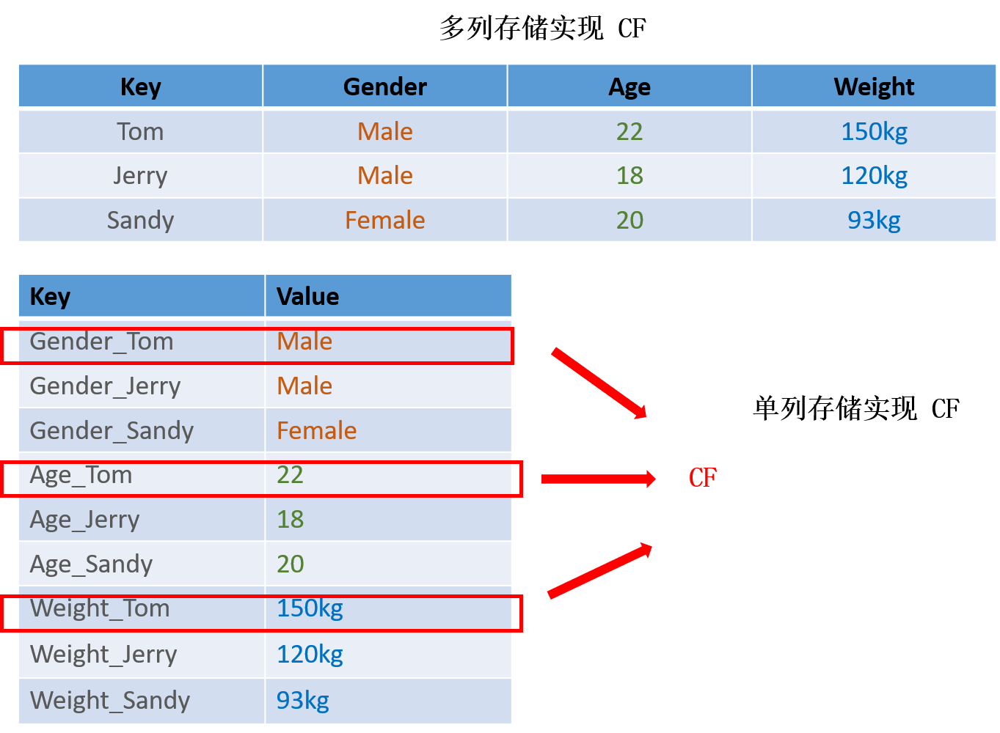
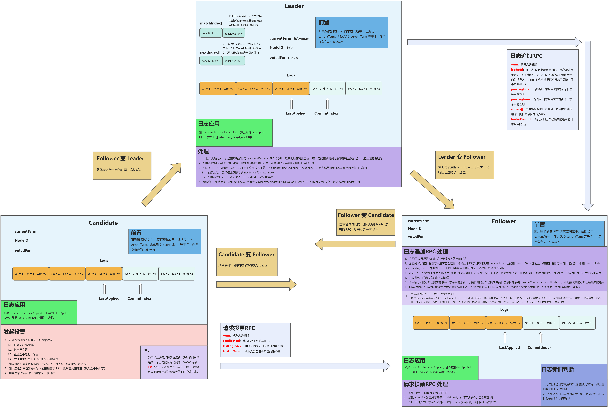
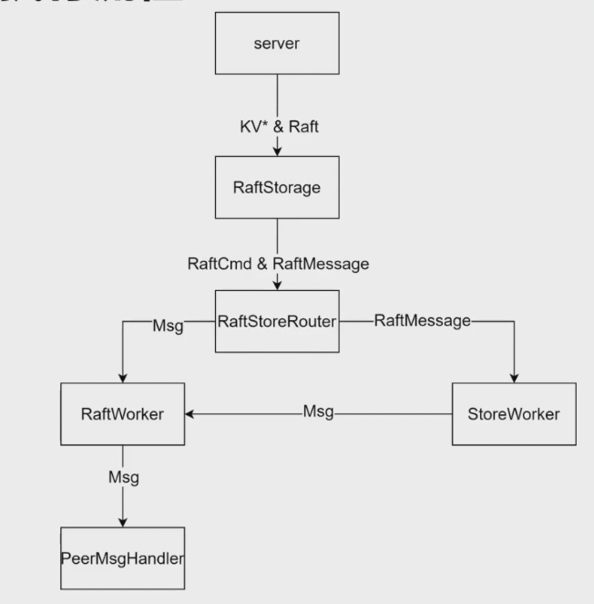
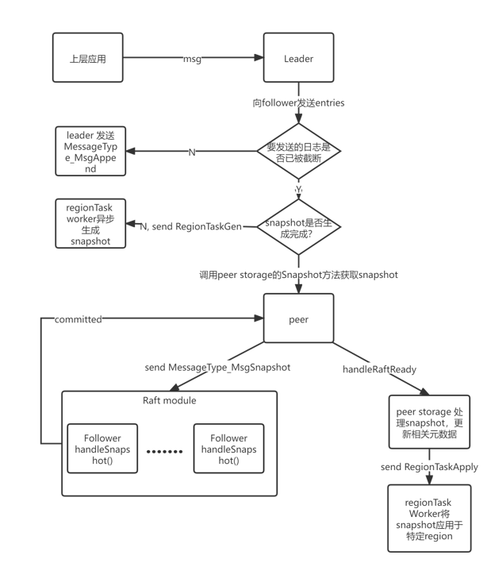
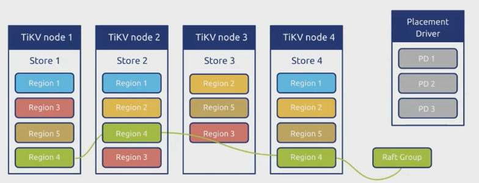

# 分布式数据库需求文档

## 简介
使用 Raft 共识算法构建 key-value 存储系统，灵感来源于MIT 6.824、TiKV 项目和Percolator 这些成熟项目

项目分为四个部分：
1. Standalone KV
实现一个独立的存储引擎。
实现原始键值服务处理程序。
2. Raft KV
实现基本的 Raft 算法。
在 Raft 之上构建一个容错的 KV 服务器。
增加对 Raft 日志垃圾回收和快照的支持。
3. Multi-raft KV
对 Raft 算法实施成员变更和领导层变更。
在 Raft 存储上实现 conf 更改和区域拆分。
实现一个基本的调度器。
4. Transaction
实现多版本并发控制层。
实现KvGet、KvPrewrite和KvCommit请求的处理程序。
实现KvScan、KvCheckTxnStatus、KvBatchRollback和KvResolveLock

## 创新性

### 传统的单机型数据库的缺陷
1. 有限的扩展性：单机数据库通常受限于硬件资源，如处理器、内存和存储容量，无法轻松扩展以满足高负载需求。
2. 单点故障：单机数据库是单点故障，如果数据库服务器发生故障，整个应用程序可能会受到严重影响，需要采取备份和恢复措施。
3. 难以维护：维护单机数据库可能需要停机时间，以进行备份、性能优化和升级，这可能会对业务产生负面影响。
4. 有限的数据冗余和容错性：传统的单机数据库通常缺乏内置的数据冗余和容错机制，因此对于数据可用性和持久性的保证相对较低。
5. 难以处理大规模数据：当数据量增长到一定规模时，单机数据库可能无法提供高性能和低延迟的查询。

### 分布式数据库的优势
1. 高可用性：分布式数据库可以配置为具有多个副本和备份，以提供更高的可用性和容错性。即使一个节点故障，系统仍然可以继续运行。
2. 良好的扩展性：分布式数据库可以轻松扩展，通过添加新的节点来增加处理能力，以适应不断增长的负载。
3. 更好的性能：分布式数据库可以通过将负载分散到多个节点上来提供更好的性能，从而减少响应时间和提高吞吐量。
4. 数据冗余和备份：分布式数据库通常具有内置的数据冗余和备份机制，以确保数据的可用性和持久性。

### 分布式数据库的技术难点
1. 数据复制和复制一致性： 为了提高可用性和容错性，分布式数据库通常使用数据复制。然而，维护复制之间的一致性和同步是一个挑战。
2. 分布式事务管理： 在分布式环境中管理事务是一项复杂的任务。要确保跨多个节点的事务的原子性、一致性、隔离性和持久性（ACID属性）需要采用复杂的协调和协议。
3. 负载均衡： 动态负载均衡是确保集群中每个节点均匀处理请求的挑战。不平衡的负载可能导致性能下降。
4. 故障检测和恢复： 在分布式环境中，节点可能会出现故障。及时检测故障并采取适当的恢复措施是至关重要的。

## 1. StandaloneKV

我们要在列族的支持下建立一个独立的 key/value 存储 gRPC 服务。Standalone 意味着只有一个节点，而不是一个分布式系统。列族（CF, Column family）是一个类似 key 命名空间的术语，即同一个 key 在不同列族中的值是不同的。可以简单地将多个 CF 视为独立的小型数据库。

该服务支持四个基本操作：Put/Delete/Get/Scan，它维护了一个简单的 key/value Pairs 的数据库，其中 key and value 都是字符串。

- Put：替换数据库中指定 CF 的某个 key 的 value。
- Delete：删除指定 CF 的 key 的 value。
- Get：获取指定 CF 的某个 key 的当前值。
- Scan：获取指定 CF 的一系列 key 的 current value。

该部分可以分为2个步骤，包括:

1. 实现一个独立的存储引擎，包括数据库初始化、启动、关闭、和基本的读写功能。
2. 实现上层调用的api接口。

## 2. RaftKV

实现一个基于 Raft 的高可用 KV 服务器。这个部分分为三个小部分，依次为：

- 实现基于 Raft 的核心功能，包括领导选举和日志同步
- 实现 Raft 的上层调用与底层存储
- 在前两者的基础上增加日志压缩和快照的功能

## 3. Multi-Raft

这一部分需要实现一个带有balance scheduler的基于multi-raft的kv服务器，需要实现领导人转移和成员变更，需要在raftstore上实现配置变更和region split，最后实现负载均衡调度器

- region

1. TiKV中管理数据的基本单位
2. 数据切片，按连续的一段key range划分
3. 一个region包含多个peer，每个peer负责一个副本
4. 一个region对应一个raft group
5. 每个region的副本均匀的分布在TiKV节点上

- Multi-Raft

1. 一个集群的数据被划分为多个region
2. 多个独立独立运行的raft group
3. 各个raft group的peer按高可用与负载均衡等规则均匀分布在各个TiKV节点中

## 4. Transaction

实现分布式事务的原子性，通过建立一个事务系统来解决多个客户端对同一个key的访问与修改操作

该事务系统将是客户端（TinySQL）和服务器（TinyKV）之间的协作协议。为了确保事务属性，这两个部分必须正确实现。我们将有一个完整的事务请求的API，独立于第一部分StandaloneKV中实现的原始请求
